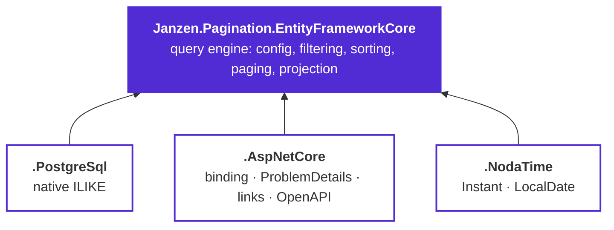

# Janzen.Pagination

[](https://www.nuget.org/packages/Janzen.Pagination.EntityFrameworkCore)
[](https://github.com/janzen01/efcore.pagination/actions/workflows/ci.yml)
[](https://janzen01.github.io/efcore.pagination/)

Dynamic, configuration-driven pagination, filtering and sorting, built for **Entity Framework Core**
and **ASP.NET Core**.

You declare, once per entity, what clients may sort by, search and filter — and which operators each field
allows. The library turns an opinionated query string into a translated EF Core query, validates everything it
cannot honour into a `400`, and returns a page with metadata and navigation links.

```http
GET /products?page=2&limit=25&sortBy=price:DESC&search=widget&filter.status=$in:Active,Draft&filter.price=$btw:10,500
```

That contract is borrowed from [nestjs-paginate](https://github.com/ppetzold/nestjs-paginate) (MIT) — the
same query parameters, operator names and response envelope.
[Query-string contract](docs/guide/query-string.md) is the exact specification.

## What you get

- **An allow-list, not a query language.** A field that is not declared is not addressable, and an operator not
  granted for a field is rejected for that field. No accidental `ORDER BY` on an unindexed column.
- **Eleven filter operators** — `$eq` `$in` `$null` `$sw` `$ilike` `$contains` `$lt` `$lte` `$gt` `$gte` `$btw` —
  with `$not` negation and `$and` / `$or` between criteria on the same field.
- **Deterministic paging.** A tie-breaker key is appended to every sort, so rows do not drift between pages.
- **Four projection strategies**, from a DTO built for you by reflection to a hand-written selector with
  sub-collections and aggregates — all keeping the `SELECT` narrow.
- **ASP.NET Core, wired.** Query-string binding, `ProblemDetails` on bad input, `first`/`prev`/`next`/`last`
  links, and OpenAPI parameters generated from the same config the engine enforces.
- **Guards by default** on page size, filter values, filter conditions, sort fields and search length.

## Packages

| Package                                   | Docs                                                          | Purpose                                                                                                                 |
|-------------------------------------------|---------------------------------------------------------------|-------------------------------------------------------------------------------------------------------------------------|
| **Janzen.Pagination.EntityFrameworkCore** | [README](src/Janzen.Pagination.EntityFrameworkCore/README.md) | Provider-agnostic query engine — fluent `PaginateConfig<T>`, filtering / sorting / search, projection, `PaginateAsync`. |
| **Janzen.Pagination.PostgreSql**          | [README](src/Janzen.Pagination.PostgreSql/README.md)          | PostgreSQL provider — case-insensitive search via native `ILIKE`.                                                       |
| **Janzen.Pagination.AspNetCore**          | [README](src/Janzen.Pagination.AspNetCore/README.md)          | ASP.NET Core integration — query-string model binding, `ProblemDetails`, links, OpenAPI metadata.                       |
| **Janzen.Pagination.NodaTime**            | [README](src/Janzen.Pagination.NodaTime/README.md)            | NodaTime support — filter / sort / project `Instant` and `LocalDate` (incl. `Instant` → `DateTimeOffset`).              |



The engine works on its own against any `IQueryable<T>`. The three add-ons are independent of each other — take
only the ones you need.

## Quick start

```bash
dotnet add package Janzen.Pagination.EntityFrameworkCore
dotnet add package Janzen.Pagination.AspNetCore
```

```csharp
// 1. Declare the contract for an entity. This is the whole allow-list.
public sealed class ProductPaginateConfigProvider : IPaginateConfigProvider<Product> {

    public readonly static PaginateConfig<Product> Config = PaginateConfig<Product>.Create(b => b
        .WithLimits(defaultLimit: 25, maxLimit: 100)
        .Sortable("name", p => p.Name)
        .Sortable("price", p => p.Price)
        .DefaultSortBy("name")
        .WithTieBreaker(p => p.Id)               // unique key appended last → deterministic paging
        .Searchable("name", p => p.Name)
        .Filterable("status", p => p.Status, PaginateFilterOperator.Eq, PaginateFilterOperator.In)
        .Filterable("price", p => p.Price, PaginateFilterOperator.Between));

    public PaginateConfig<Product> GetConfig() => Config;

}

// 2. Register.
builder.Services.AddPagination(pagination => pagination.AddAspNetCore());

// 3. Use it. PaginateQuery binds from the query string; passing Request adds the navigation links
//    (omit it and `links` is null — `meta` alone carries the paging state).
[HttpGet]
[PaginatedQuery<ProductPaginateConfigProvider>]
public Task<PaginatedResponse<ProductDto>> List([FromQuery] PaginateQuery request, CancellationToken ct) =>
    db.Products.PaginateAsync<Product, ProductDto>(
        request, ProductPaginateConfigProvider.Config, this.Request, ct);
```

```json
{
  "items": [ { "id": "7f3c…", "name": "Widget Pro", "price": 249.00 } ],
  "meta":  { "totalItems": 26, "itemCount": 1, "itemsPerPage": 25, "totalPages": 2, "currentPage": 2 },
  "links": { "first": "/products?limit=25&page=1", "previous": "/products?limit=25&page=1",
             "next": null, "last": "/products?limit=25&page=2" }
}
```

The full walkthrough is in **[Getting started](docs/guide/getting-started.md)**.

## The query string, at a glance

| Parameter        | Example                              | Meaning |
|------------------|--------------------------------------|---------|
| `page`           | `?page=2`                            | 1-based page number. |
| `limit`          | `?limit=50`                          | Page size, capped by the config's `MaxLimit`. |
| `sortBy`         | `?sortBy=price:DESC&sortBy=name:ASC` | Repeatable, applied in order. |
| `search`         | `?search=acme`                       | Free text over the searchable fields. |
| `searchBy`       | `?searchBy=name`                     | Narrows `search` to a subset of them. |
| `filter.<field>` | `?filter.price=$btw:10,500`          | `[$not:][$and:\|$or:]$operator:value` — repeatable per field. |

Every operator, every value format and the complete `400` catalogue: **[Query-string
contract](docs/guide/query-string.md)**.

## Documentation

**[→ Full guide](docs/guide/)** — getting started, the query-string contract, configuration, projections,
ASP.NET Core, providers and custom types, recipes.

| | |
|---|---|
| [Getting started](docs/guide/getting-started.md) | Install → register → a working paginated endpoint. |
| [Query-string contract](docs/guide/query-string.md) | Every parameter and operator, with the error catalogue. |
| [Configuration](docs/guide/configuration.md) | Every builder method: what it enables and what it rejects. |
| [Projections](docs/guide/projections.md) | The four entry points and how to pick between them. |
| [ASP.NET Core](docs/guide/aspnetcore.md) | Binding, `ProblemDetails`, links, OpenAPI, Minimal APIs. |
| [Providers & custom types](docs/guide/providers-and-types.md) | `LIKE` vs `ILIKE`, NodaTime, your own value types. |
| [Recipes](docs/guide/recipes.md) | RBAC, collection filters, aggregates, testing, performance. |

Also in the repository: **[SETUP.md](SETUP.md)** for building the library itself, and **[CLAUDE.md](CLAUDE.md)**
for architecture, versioning and the decisions behind them (written for humans and AI agents alike).

## Status

> Versions track the framework: the first component is the **.NET / EF Core major** the package targets, so this
> is the **10.x** line (pairing with .NET 10 and EF Core 10) rather than 1.x. Older lines are not maintained in
> parallel. Release notes live on the [Releases](https://github.com/janzen01/efcore.pagination/releases) page —
> there is no changelog file in the repository.

Security reports go through [private vulnerability
reporting](https://github.com/janzen01/efcore.pagination/security/advisories/new) — see [SECURITY.md](SECURITY.md).

## License

[MIT](LICENSE) © Lubos Jansky
