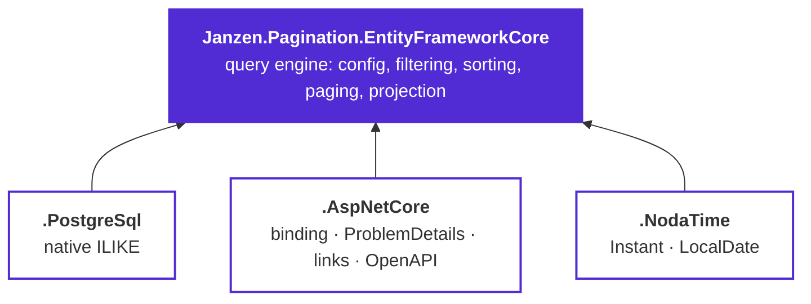

# Janzen.Pagination — guide

Everything a consumer needs, in reading order. Each page stands on its own, so jumping straight to the one
you need also works.

| Page | What it answers |
|------|-----------------|
| **[Getting started](getting-started.md)** | Install, register, and get a paginated endpoint returning JSON. |
| **[Query-string contract](query-string.md)** | Every parameter and every filter operator, with request → SQL examples. |
| **[Configuration](configuration.md)** | Every `PaginateConfigBuilder<T>` method: what it enables and what it rejects. |
| **[Projections](projections.md)** | The four `Paginate*Async` entry points and how to pick between them. |
| **[ASP.NET Core](aspnetcore.md)** | Model binding, `ProblemDetails`, links, OpenAPI, controllers and Minimal APIs. |
| **[Providers & custom types](providers-and-types.md)** | `LIKE` vs `ILIKE`, NodaTime, teaching the engine your own types. |
| **[Recipes](recipes.md)** | RBAC, collection filters, aggregates, `Link` headers, non-web callers, testing. |

## The 30-second version

```csharp
// 1. Declare the contract for an entity — nothing outside it is addressable from the query string.
var config = PaginateConfig<Product>.Create(b => b
    .WithLimits(defaultLimit: 25, maxLimit: 100)
    .Sortable("name", p => p.Name)
    .DefaultSortBy("name")
    .WithTieBreaker(p => p.Id)
    .Searchable("name", p => p.Name)
    .Filterable("status", p => p.Status, PaginateFilterOperator.Eq, PaginateFilterOperator.In));

// 2. Execute it against any IQueryable.
PaginatedResponse<ProductDto> page = await db.Products.PaginateAsync<Product, ProductDto>(request, config);
```

```http
GET /products?page=2&limit=25&sortBy=name:DESC&search=acme&filter.status=$in:active,pending
```

## How the pieces fit



The engine works on its own against any `IQueryable<T>`. The three add-ons are independent of each other —
take only the ones you need.

## Two things worth knowing up front

**The configuration is the allow-list.** A field that is not declared `Sortable` / `Searchable` / `Filterable`
cannot be sorted, searched or filtered on, and an operator not listed for a field is rejected for that field.
There is no "expose the whole entity" mode, deliberately.

**Paging is offset-based and needs a deterministic order.** `WithTieBreaker(p => p.Id)` appends a unique key as
the final ordering key so two rows that compare equal on the primary sort still land in a stable order. Without
any order at all the engine refuses the query rather than returning silently unstable pages.
