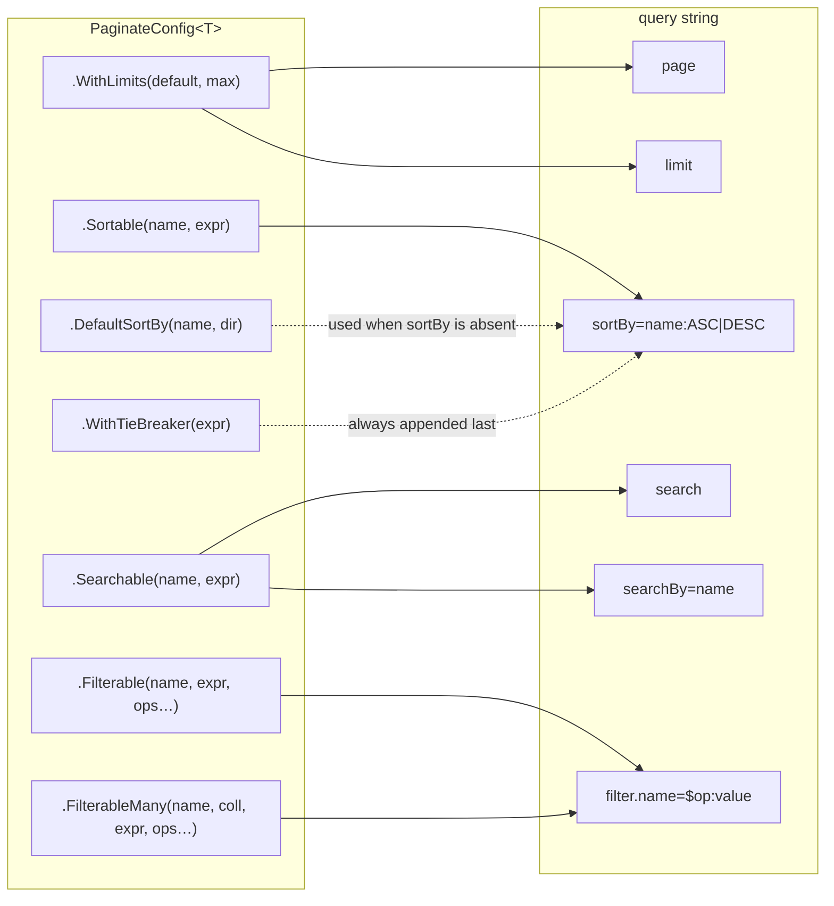

# Configuration

`PaginateConfig<TEntity>` is the contract between your entity and the query string. It is built once with a
fluent builder, is immutable, and is safe to hold in a static field.

```csharp
var config = PaginateConfig<Product>.Create(builder => builder
    .WithLimits(25, 100)
    .Sortable("name", p => p.Name)
    .WithTieBreaker(p => p.Id));
```

## What each declaration unlocks



Field names are **arbitrary public aliases** — they need not match property names, and they are matched
case-insensitively. Declaring the same name twice for the same kind replaces the earlier declaration.

---

## Limits and guards

### `WithLimits`

```csharp
.WithLimits(defaultLimit: 25, maxLimit: 100)
```

**Required.** `Create` throws `InvalidOperationException` if it is missing — there is no implicit page size,
because the right one is a property of the resource, not of the library. Both values must be positive and
`defaultLimit <= maxLimit`.

### `WithGuards`

```csharp
.WithGuards(maxFilterValues: 100, maxFilterConditions: 20, maxSortFields: 5, maxSearchLength: 256)
```

Optional ceilings that bound the cost of a single request; the values above are the defaults. Each parameter
is independent, so name the ones you want:

```csharp
.WithGuards(maxFilterValues: 500)     // large $in lists on this resource, everything else default
```

See [Query-string → Guards](query-string.md#guards) for what each one rejects.

---

## Sorting

### `Sortable`

```csharp
.Sortable("name", p => p.Name)
.Sortable("author", p => p.Author.LastName)          // navigation properties are fine
.Sortable("reviewCount", p => p.Reviews.Count)       // anything EF can translate to ORDER BY
```

Enables `?sortBy=name:ASC`. The selector is used as-is in `OrderBy`/`ThenBy`, so any expression your provider
can translate works.

### `DefaultSortBy`

```csharp
.DefaultSortBy("isFeatured", PaginateSortDirection.Desc)
.DefaultSortBy("published", PaginateSortDirection.Desc)
.DefaultSortBy("title")                               // Asc is the default
```

Applied in declaration order when the request sends no `sortBy` at all. A request that sends `sortBy` replaces
the defaults entirely — they do not merge. The field must also be declared `Sortable`, or `Create` throws.

### `WithTieBreaker`

```csharp
.WithTieBreaker(p => p.Id)
```

Appends a unique key as the **final** ordering key on every query, whether the sort came from the request or
from the defaults. Strongly recommended: offset paging over rows that compare equal on the primary sort has no
defined order, so the same row can appear on two pages or on none. `Id` (or any unique column) fixes that.

It is also the fallback that keeps a resource queryable when neither `sortBy` nor `DefaultSortBy` applies —
without any of the three the engine rejects the request.

---

## Searching

### `Searchable`

```csharp
.Searchable("name", p => p.Name)
.Searchable("description", p => p.Description)        // string? is fine
.Searchable("authorName", p => p.Author.DisplayName)
```

The selector must return `string?`. Every searchable field participates in `?search=` (OR'd together) and can
be addressed individually via `?searchBy=`.

### `IgnoreSearchByInQueryParam`

```csharp
.IgnoreSearchByInQueryParam()
```

Drops `searchBy` from the contract: `search` then always spans all searchable fields. Use it when narrowing
the search would leak which columns exist, or when you simply do not want the extra surface.

---

## Filtering

### `Filterable`

```csharp
.Filterable("status", p => p.Status, PaginateFilterOperator.Eq, PaginateFilterOperator.In)
.Filterable("price",  p => p.Price,
    PaginateFilterOperator.Eq,
    PaginateFilterOperator.GreaterThanOrEqual,
    PaginateFilterOperator.LessThanOrEqual,
    PaginateFilterOperator.Between)
.Filterable("categoryName", p => p.Category.Name, PaginateFilterOperator.Eq, PaginateFilterOperator.ILike)
```

**At least one operator is required** — an empty operator list throws. The operator list is the allow-list for
that field: `?filter.price=$ilike:x` on the field above is a `400`, because `ILike` was not granted.

`TValue` decides how raw strings are parsed and which operators are legal at runtime: string pattern operators
(`$sw`, `$ilike`) require a `string` field, `$contains` requires a string or a collection.

Pick operators deliberately rather than granting the full set. Each one you grant is a query shape the database
has to serve — `$ilike` on an unindexed text column is a sequential scan the client can trigger at will.

### `FilterableMany`

Filters the entity by a value on **any element** of a child collection — translated to `Any(...)`:

```csharp
// ?filter.tag=$eq:dotnet  → articles that have at least one tag named "dotnet"
.FilterableMany("tag", a => a.Tags, t => t.Name,
    PaginateFilterOperator.Eq, PaginateFilterOperator.In, PaginateFilterOperator.ILike)

// ?filter.reviewerId=$in:a,b → orders reviewed by any of these people
.FilterableMany("reviewerId", o => o.Reviews, r => r.ReviewerId,
    PaginateFilterOperator.Eq, PaginateFilterOperator.In)
```

The first lambda selects the collection, the second selects the value on one element. The operator is applied
to that value inside the `Any` predicate, so `$in:a,b` means *has an element matching a **or** b*.

For a field that already **is** a collection on the entity (an array column, say), use plain `Filterable` with
`PaginateFilterOperator.Contains` instead — there `$contains:a,b` means the collection holds **both**.

---

## Documentation and access control

### `ShowBadge`

```csharp
.Sortable("slug", p => p.Slug).ShowBadge("Public", "language-public")
.Searchable("title", p => p.Title).ShowBadge("Beta")     // no class → neutral chip
```

Attaches a label to **the field declared immediately before it**, surfaced in the generated OpenAPI metadata
and rendered as a chip by API reference UIs such as Scalar. Calling it before any field throws.

The optional CSS class **must start with `language-`**. That is not a style preference: it is the only class
prefix the reference UI's markdown sanitizer keeps on an inline `<code>` element in a parameter description —
inline styles and other classes are stripped. Anything else throws at configuration time. You then colour it
from the reference UI's own custom CSS:

```css
.language-public { background: #277A2C; color: #fff; border-radius: 4px; padding: 1px 6px }
```

### `When` — conditional fields

```csharp
.Filterable("isHidden", a => a.IsHidden, PaginateFilterOperator.Eq)
    .When(currentUserIsAdmin).ShowBadge("Admin only", "language-admin")
```

Marks the preceding field as conditional. When the boolean is `false` the field behaves at query time exactly
as if it were **not configured** — a request targeting it gets a `400` worded identically to an unknown field,
so its existence is not disclosed. It stays in the OpenAPI output either way, which keeps the documented
surface the widest one.

`.When` **must** be paired with `.ShowBadge(...)` — otherwise `Create` throws, on the grounds that a
restriction nobody can see in the docs is a support ticket waiting to happen.

The library stays auth-agnostic: you evaluate the boolean from whatever you have — a role, a claim, a tenant, a
feature flag. Because it is captured when the config is **built**, per-user gating means building the config
per request or caching one config per role. See [Recipes → role-based
configurations](recipes.md#role-based-configurations).

A default sort field disabled by `.When(false)` is skipped rather than fatal, so the resource still pages for
callers who cannot see it.

---

## Providers

`IPaginateConfigProvider<TEntity>` is how the ASP.NET Core integration finds a config to document. You
implement only the typed `GetConfig()`; the non-generic member comes from a default interface implementation.

```csharp
public sealed class ProductPaginateConfigProvider : IPaginateConfigProvider<Product> {

    public readonly static PaginateConfig<Product> Config = PaginateConfig<Product>.Create(b => b
        .WithLimits(25, 100)
        .Sortable("name", p => p.Name)
        .WithTieBreaker(p => p.Id));

    public PaginateConfig<Product> GetConfig() => Config;

}
```

Building a config walks expression trees and freezes several dictionaries, so build it **once** — a static
field, or a singleton in DI. Rebuilding per request works but is wasted allocation; the exception is per-user
gating, where the cheap route is one cached config per role rather than one per request.

## Reading the configuration back

Every config exposes its own metadata, which is how the OpenAPI transformer documents itself and is equally
available to you — for a `/meta` endpoint, an admin UI, or a contract test:

```csharp
IPaginateConfig meta = provider.GetConfig();

meta.DefaultLimit;        // int
meta.MaxLimit;            // int
meta.DefaultSortBy;       // IReadOnlyList<PaginateSort>   — Field + Direction
meta.SortableFields;      // IReadOnlyList<PaginateFieldMetadata>        — Name, Type, Badge?
meta.SearchableFields;    // IReadOnlyList<PaginateFieldMetadata>
meta.FilterableFields;    // IReadOnlyList<PaginateFilterFieldMetadata>  — + allowed Operators
meta.MaxFilterValues; meta.MaxFilterConditions; meta.MaxSortFields; meta.MaxSearchLength;
meta.IgnoreSearchByInQueryParam;
```

Conditional fields appear in these lists regardless of their condition — the metadata is the documented
surface, not the per-caller one.
