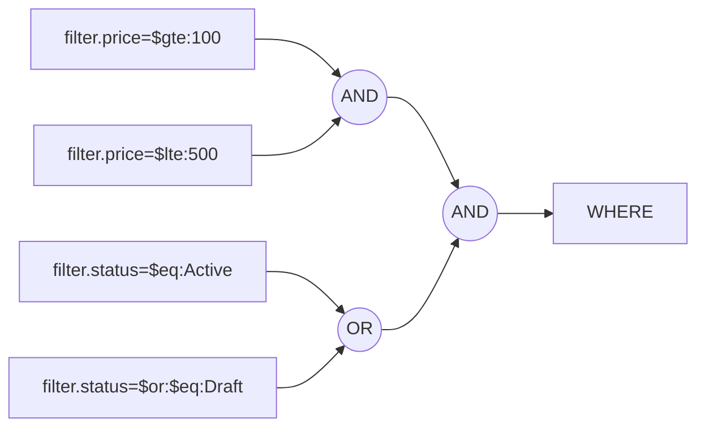

# Query-string contract

The complete wire format. Six inputs, nothing else:

| Parameter        | Repeatable | Example                       | Notes |
|------------------|:----------:|-------------------------------|-------|
| `page`           | no         | `?page=2`                     | 1-based, defaults to `1`. |
| `limit`          | no         | `?limit=50`                   | Defaults to the config's `DefaultLimit`, capped by `MaxLimit`. |
| `sortBy`         | **yes**    | `?sortBy=price:DESC&sortBy=name:ASC` | Applied in the order given. |
| `search`         | no         | `?search=acme`                | Free text over the searchable fields. |
| `searchBy`       | **yes**    | `?searchBy=name&searchBy=sku` | Narrows `search` to a subset of them. |
| `filter.<field>` | **yes**    | `?filter.status=$eq:Active`   | One or more criteria per field. |

**Anything else is ignored.** `offset`, `utm_source`, your own tracking parameters — the binder reads exactly
the six above and pages normally. This is deliberate: strict binding would reject perfectly ordinary client
parameters. `page` and `limit` themselves *are* validated and return `400`.

For repeatable parameters, repeat the key (`?sortBy=a:ASC&sortBy=b:DESC`). Comma-joining them in one value
does **not** work — that reads as a single malformed instruction.

---

## `page`

1-based. Must parse as a positive integer with no sign, decimal point or padding — `0`, `-1`, `+2`, `2.0` and
`abc` all return `400 Query parameter 'page' must be a positive integer.`

Pages past the end are **not** an error: you get `items: []` with truthful `meta`, and the engine skips the
second query entirely.

## `limit`

Omitted → the config's `DefaultLimit`. Supplied → must be between `1` and the config's `MaxLimit`, otherwise
`400 Query parameter 'limit' must be between 1 and 100.` An over-large limit is **rejected, not clamped** —
silently returning fewer rows than asked for is the harder bug to notice.

## `sortBy`

```
sortBy=<field>:<ASC|DESC>
```

Both parts are required — a bare `?sortBy=name` is a `400`. The direction is case-insensitive; the field name
is matched against the configured `Sortable` names, also case-insensitively. Repeat the parameter for
secondary sorts, in priority order:

```http
GET /products?sortBy=status:ASC&sortBy=price:DESC
```

- More than `MaxSortFields` (default 5) → `400`.
- A field that is not configured sortable (or is disabled for this caller via [`.When(...)`](configuration.md#when--conditional-fields)) → `400 Sort for field 'x' is not configured.`
- No `sortBy` at all → the config's `DefaultSortBy` entries, in declaration order.
- The configured **tie-breaker is always appended last**, whichever of the two applied.

If there is no `sortBy`, no `DefaultSortBy` and no tie-breaker, the engine refuses the request rather than
paging an unordered set:

> Pagination requires a deterministic sort order. Pass 'sortBy', configure DefaultSortBy(...), or add
> WithTieBreaker(...) to the pagination configuration.

## `search` and `searchBy`

`search` matches a substring, case-insensitively on PostgreSQL with the `.PostgreSql` package (see
[Providers](providers-and-types.md)), otherwise per the column collation. The term is matched against every
configured searchable field and the results OR'd together:

```http
GET /people?search=novak            → name ILIKE '%novak%' OR email ILIKE '%novak%'
GET /people?search=novak&searchBy=email → email ILIKE '%novak%'
```

- `%` and `_` in the term are escaped, so they match literally rather than as wildcards.
- Longer than `MaxSearchLength` (default 256) → `400`.
- A `searchBy` field that is not searchable → `400`; the same field twice → `400`. Both are validated **even
  when `search` is absent**, so a typo surfaces instead of silently searching everything.
- If the config declares no searchable fields at all, sending `search` is a `400`, not a no-op.
- `IgnoreSearchByInQueryParam()` in the config makes `searchBy` ignored entirely; search then always spans all
  searchable fields.

## `filter.<field>`

### Grammar

```
filter.<field> = [$not:] [$and: | $or:] $<operator>[:<value>[,<value>…]]
```

The prefixes are optional and order-independent. Parsing splits on the first `:` at each step and stops at the
first operator token — **everything after that colon is the value, verbatim**, so values may contain colons:

```http
?filter.createdAt=$gte:2026-01-01T00:00:00Z
```

Field names are matched case-insensitively, and case variants of the same field collapse into one entry.

### Operators

Each field whitelists its own operators in the config; sending one that is not whitelisted for that field is a
`400`, even though it exists.

| Token | `PaginateFilterOperator` | Applies to | Meaning |
|-------|--------------------------|------------|---------|
| `$eq` | `Eq` | any | `= value` |
| `$in` | `In` | any | `IN (a, b, c)` — comma-separated |
| `$null` | `Null` | any | `IS NULL` |
| `$sw` | `StartsWith` | string | `LIKE 'value%'` |
| `$ilike` | `ILike` | string | `LIKE '%value%'` — `ILIKE` with the PostgreSql package |
| `$contains` | `Contains` | string **or** collection | on a string: identical to `$ilike`; on a collection: the collection contains **all** listed values |
| `$lt` `$lte` | `LessThan` `LessThanOrEqual` | comparable | `<` / `<=` |
| `$gt` `$gte` | `GreaterThan` `GreaterThanOrEqual` | comparable | `>` / `>=` |
| `$btw` | `Between` | comparable | inclusive range — exactly two comma-separated values |

Examples:

```http
?filter.status=$eq:Active
?filter.status=$in:Active,Draft
?filter.discontinuedAt=$null
?filter.name=$sw:Wid
?filter.name=$ilike:widget
?filter.price=$btw:10,99.90
?filter.createdAt=$gte:2026-01-01
?filter.tagIds=$contains:3f2a…,9b1c…        ← collection field: must contain both
```

Notes that bite:

- **`$ilike` is not always case-insensitive.** Without the `.PostgreSql` package it emits a portable `LIKE`,
  so case-sensitivity follows the column collation. The token name reflects the intent, not a guarantee.
- **`$contains` on a string is `$ilike`.** They produce the same `%value%` predicate. `$contains` only differs
  on collection fields, where it means set containment (AND across the listed values).
- **`$null` on a non-nullable value type matches nothing** — the column cannot be null, so the predicate is a
  constant `false`. `$not:$null` on such a field matches everything.
- **No escaping inside value lists.** `$in`, `$btw` and `$contains`-on-a-collection split on `,` and trim; a
  value that itself contains a comma cannot be expressed. Single-value operators take the value whole, commas
  included.

### `$not` — negation

Negates the single criterion it prefixes:

```http
?filter.status=$not:$eq:Discontinued
?filter.deletedAt=$not:$null
?filter.name=$not:$ilike:test
```

### `$and` / `$or` — combining criteria on one field

Repeat `filter.<field>` to apply several criteria to the same field. Each criterion says how it joins the ones
before it; the default is `$and`:

```http
# 100 <= price <= 500
?filter.price=$gte:100&filter.price=$lte:500

# status is Active OR Draft (equivalent to $in here, but works for any operator)
?filter.status=$eq:Active&filter.status=$or:$eq:Draft

# name starts with "Wid" but does not contain "test"
?filter.name=$sw:Wid&filter.name=$and:$not:$ilike:test
```

Criteria on **different** fields are always joined with `AND`. There is no cross-field `OR` and no grouping /
parentheses — that is a deliberate ceiling on how much query language is exposed. Combine on one field, and
express anything richer as a dedicated filterable field.



### Value formats

| Target type | Accepted |
|-------------|----------|
| `string` | anything, used verbatim |
| `bool` | `true` / `false`, case-insensitive (not `1` / `0`) |
| `Guid` | any format `Guid.TryParse` accepts |
| integers, `decimal`, `float`, `double` | invariant culture — `.` as the decimal separator |
| `DateTime`, `DateTimeOffset` | invariant culture; a value with no offset is read as **UTC** |
| enums | **by name only**, case-insensitive (`Active`, `active`). Numeric values are rejected, and so is a number that does not correspond to a defined member. |
| `Instant`, `LocalDate` | ISO-8601, with the `.NodaTime` package |
| anything else | `400`, unless registered via [`PaginateTypeSupport`](providers-and-types.md#teaching-the-engine-a-new-type) |

An empty value (`?filter.price=$eq:`) is `null` for a nullable target and a `400` for a non-nullable one. Use
`$null` rather than relying on that.

Values are emitted as SQL **parameters** (`EF.Parameter`), not inlined literals, so the database can reuse
query plans across differing filter values.

---

## Guards

Per-config ceilings that bound how expensive one request can be. Defaults shown; change them with
[`WithGuards(...)`](configuration.md#withguards).

| Guard | Default | Exceeded → |
|-------|--------:|------------|
| `MaxLimit` | *(required, no default)* | `400 Query parameter 'limit' must be between 1 and N.` |
| `MaxFilterValues` | 100 | `400 Filter 'x' accepts at most N values.` |
| `MaxFilterConditions` | 20 | `400 Too many filter conditions; at most N are allowed.` |
| `MaxSortFields` | 5 | `400 Too many sort fields; at most N are allowed.` |
| `MaxSearchLength` | 256 | `400 Search term must not exceed N characters.` |

`MaxFilterConditions` counts every `filter.*` value across all fields, so 20 conditions total — not 20 per
field.

---

## Error catalogue

Everything below is a `PaginateQueryException`, surfaced by the ASP.NET Core integration as
`400 Bad Request` with `title: "Invalid query"` and the message as `detail`. See
[ASP.NET Core → Errors](aspnetcore.md#errors-as-problemdetails).

| Message | Cause |
|---------|-------|
| `Query parameter 'page' must be a positive integer.` | `page` is not a plain positive integer. |
| `Query parameter 'limit' must be between 1 and N.` | `limit` out of range. |
| `Sort value 'x' must use the format 'field:ASC' or 'field:DESC'.` | Missing the `:direction` half. |
| `Sort direction 'x' is not supported.` | Direction is neither `ASC` nor `DESC`. |
| `Too many sort fields; at most N are allowed.` | More `sortBy` values than `MaxSortFields`. |
| `Sort for field 'x' is not configured.` | Not declared `Sortable`, or disabled by `.When(false)`. |
| `Pagination requires a deterministic sort order. …` | No `sortBy`, no `DefaultSortBy`, no tie-breaker. |
| `Search term must not exceed N characters.` | `search` longer than `MaxSearchLength`. |
| `Search is not configured for this resource.` | `search` sent to a config with no searchable fields. |
| `Search for field 'x' is not configured.` | Unknown `searchBy` field. |
| `Search field 'x' is specified more than once.` | Duplicate `searchBy` value. |
| `Filter for field 'x' is not configured.` | Not declared `Filterable`, or disabled by `.When(false)`. |
| `Filter 'x' must not be empty.` | `?filter.x=` with no value at all. |
| `Filter 'x' uses unknown operator '$foo'.` | Token is not one of the operators above. |
| `Filter 'x' must use the format '$operator:value'.` | No operator token, or an operator other than `$null` used bare. |
| `Filter 'x' does not support operator '$foo'.` | Valid operator, not whitelisted for that field. |
| `Filter 'x' requires at least one '$in' value.` | `$in` with an empty list. |
| `Filter 'x' requires exactly two '$btw' values.` | `$btw` with anything but two values. |
| `Filter 'x' requires at least one '$contains' value.` | `$contains` on a collection with an empty list. |
| `Filter 'x' supports '$contains' only for string or collection fields.` | `$contains` on a scalar. |
| `Filter 'x' supports string pattern operators only for string fields.` | `$sw` / `$ilike` on a non-string. |
| `Too many filter conditions; at most N are allowed.` | Over `MaxFilterConditions`. |
| `Filter 'x' accepts at most N values.` | Over `MaxFilterValues` in one list. |
| `Value 'v' is not valid for type 'T'.` | Unparseable, or an undefined enum member. |
| `Value 'v' is not a valid GUID.` / `boolean` / `instant` / `local date` | Type-specific parse failure. |
| `Value for type 'T' must not be empty.` | Empty value for a non-nullable target. |
| `Filtering values of type 'T' is not supported.` | No parser registered for that CLR type. |

A field disabled by `.When(false)` reports **exactly** the same message as a field that does not exist — the
existence of an admin-only field is not disclosed to callers who cannot use it.
