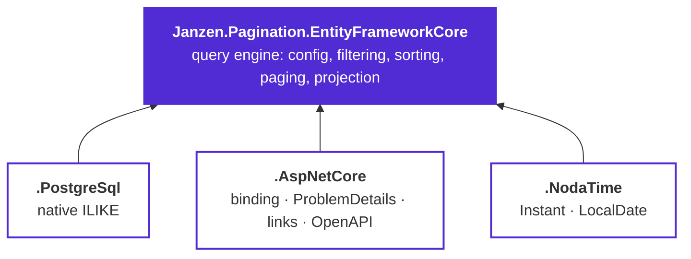

# Janzen.Pagination

Dynamic, configuration-driven pagination, filtering and sorting, built for **Entity Framework Core** and
**ASP.NET Core**.

You declare, once per entity, what clients may sort by, search and filter — and which operators each field
allows. The library turns an opinionated query string into a translated EF Core query, validates everything it
cannot honour into a `400`, and returns a page with metadata and navigation links.

```http
GET /products?page=2&limit=25&sortBy=price:DESC&search=widget&filter.status=$in:Active,Draft&filter.price=$btw:10,500
```

> Versions track the framework: the first component is the .NET / EF Core major the package targets, so this is
> the **10.x** line, pairing with .NET 10 and EF Core 10. Older lines are not maintained in parallel, and
> release notes live on the [Releases](https://github.com/janzen01/efcore.pagination/releases) page.

## Packages

Four packages. The engine works on its own against any `IQueryable<T>`; the three add-ons build on it and are
independent of each other, so take only the ones you need.

| Package | Purpose |
|---------|---------|
| `Janzen.Pagination.EntityFrameworkCore` | Provider-agnostic query engine — fluent `PaginateConfig<T>`, filtering / sorting / search, projection, `PaginateAsync`. |
| `Janzen.Pagination.PostgreSql` | PostgreSQL provider — case-insensitive search via native `ILIKE`. |
| `Janzen.Pagination.AspNetCore` | ASP.NET Core integration — query-string model binding, `ProblemDetails`, links, OpenAPI metadata. |
| `Janzen.Pagination.NodaTime` | NodaTime support — filter / sort / project `Instant` and `LocalDate` (incl. `Instant` → `DateTimeOffset`). |



## Install

```bash
dotnet add package Janzen.Pagination.EntityFrameworkCore
dotnet add package Janzen.Pagination.AspNetCore
```

Prereleases carry an `-rc.N` suffix — add `--prerelease` to install one.

## Where to go next

The guide is meant to be read in order, but each page stands on its own.

**[Getting started](guide/getting-started.md)** takes it from install to a paginated endpoint returning JSON.
**[Query-string contract](guide/query-string.md)** is the exact specification of every parameter, every
operator and every `400`.

That contract is borrowed from [nestjs-paginate](https://github.com/ppetzold/nestjs-paginate) (MIT) — the same
query parameters, operator names and response envelope.
