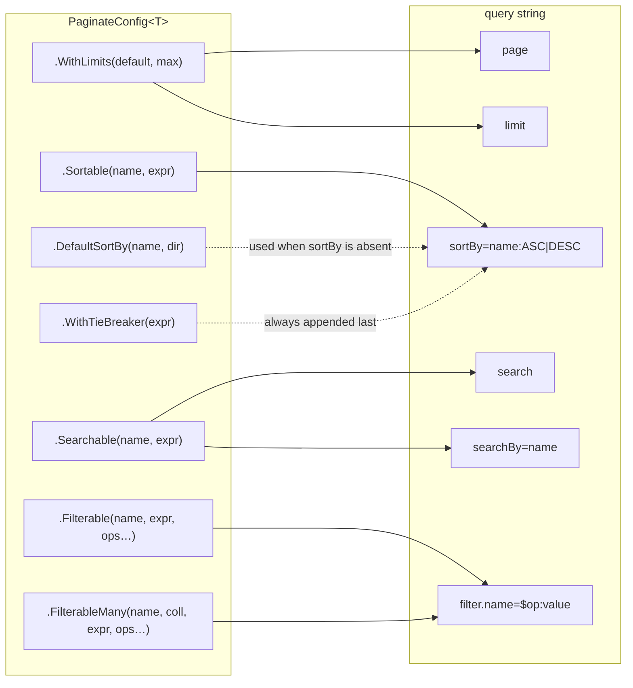

# Configuration

`PaginateConfig<TEntity>` is the contract between your entity and the query string. Nothing a caller sends is
interpreted against your model directly — it is matched against this declaration first, and rejected if it
does not appear here.

```csharp
var config = PaginateConfig<Product>.Create(builder => builder
    .WithLimits(25, 100)
    .Sortable("name", p => p.Name)
    .WithTieBreaker(p => p.Id));
```

That is a complete, working configuration: products can be paged and sorted by name, and by nothing else.

> This page is the reasoning. For every builder method, its signature and what it refuses, see
> [Configuration API](/reference/configuration/).

## It is an allow-list, not a query language

A field you do not declare is not addressable, and an operator you do not grant for a field is rejected for
that field. There is no wildcard and no opt-out.

This is the difference between exposing pagination and exposing your database. A generic query API lets a
caller sort by any column — including the unindexed `text` one — and filter with any operator, including a
leading-wildcard match across ten million rows. Here, every query shape a caller can produce is one you wrote
down, so the set of statements your database will ever see is finite and reviewable.

The practical consequence: **declare what a screen actually needs**, not everything that might one day be
useful. Adding a field later is a one-line change; discovering in production that someone can `$ilike` an
unindexed column is not.

## What each declaration unlocks



Field names are **arbitrary public aliases**. They need not match property names, and choosing them well is
worth a minute: they are what appears in your OpenAPI document, in client code and in the URLs your callers
bookmark. Renaming one later is a breaking change to your API even though nothing in your entity moved.

## Three things you have to decide

### How big a page may be

There is no default page size, and `WithLimits` is the one call you cannot omit. The right size is a property
of the resource — how wide the row is, how expensive the projection, how the client renders it — so the
library refuses to guess.

```csharp
.WithLimits(defaultLimit: 25, maxLimit: 100)
```

An over-limit request is rejected rather than trimmed. A caller who asks for 5000 and silently receives 100
will page through your collection wrongly and never find out why.

### How the order stays stable

Offset paging only works if the sort is total. Rows that compare equal on the sort you asked for have no
defined order between them, so the database may return them one way for page 1 and another way for page 2 —
one row shown twice, another never shown at all. It is a bug that looks like data corruption and reproduces
only under load.

A tie-breaker on any unique column removes the ambiguity for good:

```csharp
.Sortable("price", p => p.Price)
.WithTieBreaker(p => p.Id)          // appended to every sort, always last
```

The engine takes this seriously enough to refuse: with no `sortBy`, no `DefaultSortBy` and no tie-breaker, a
request fails rather than paging an unordered set. Configure the tie-breaker once and the question never
arises again.

`DefaultSortBy` is the separate question of what "no `sortBy`" should mean — newest first, featured first —
and it applies only when the caller expresses no preference at all. A request that sends `sortBy` replaces
your defaults entirely rather than merging with them.

### What is addressable, and how

Sorting, searching and filtering are three independent declarations, and a field may appear in any
combination of them:

```csharp
.Sortable("name", p => p.Name)                                        // ?sortBy=name:ASC
.Searchable("name", p => p.Name)                                      // ?search=widget
.Filterable("status", p => p.Status,                                  // ?filter.status=$eq:Active
    PaginateFilterOperator.Eq, PaginateFilterOperator.In)
```

Filters carry a second decision the other two do not: **which operators**. The list is per field, and it is
where the cost of a query gets decided. `$eq` and `$in` on an indexed column are cheap; `$ilike` on an
unindexed text column is a sequential scan a caller can trigger at will. Grant the operators a screen uses,
not the full set.

For values that live on a **child collection**, `FilterableMany` filters the entity by *any* matching element,
without you writing the join:

```csharp
// ?filter.tag=$eq:dotnet  → products carrying at least one tag named "dotnet"
.FilterableMany("tag", p => p.Tags, t => t.Name,
    PaginateFilterOperator.Eq, PaginateFilterOperator.In)
```

The first lambda picks the collection, the second picks the value on one element, and the engine builds the
`EXISTS`. It is easy to miss because the need usually looks like "I have to write a custom endpoint for this"
— a tag filter, an order filtered by who reviewed it, a document filtered by a recipient.

## Where a config lives

Building one walks expression trees and freezes several dictionaries, so build it **once** and share it. The
result is immutable and thread-safe.

```csharp
public sealed class ProductPaginateConfigProvider : IPaginateConfigProvider<Product> {

    public readonly static PaginateConfig<Product> Config = PaginateConfig<Product>.Create(b => b
        .WithLimits(25, 100)
        .Sortable("name", p => p.Name)
        .Sortable("price", p => p.Price)
        .Searchable("name", p => p.Name)
        .Filterable("status", p => p.Status, PaginateFilterOperator.Eq, PaginateFilterOperator.In)
        .WithTieBreaker(p => p.Id));

    public PaginateConfig<Product> GetConfig() => Config;

}
```

Wrapping it in an `IPaginateConfigProvider<TEntity>` is what lets the
[ASP.NET Core integration](/integrations/aspnetcore/) find the config and generate OpenAPI parameters from
the same declaration the engine enforces — so the documented surface and the accepted surface cannot drift
apart.

Some validation cannot happen until the whole config is known, and it runs at the end of `Create`. A config
that compiles can still throw on first use, so build it somewhere a test or a startup path will notice.

## Fields not everyone may use

`.When(condition)` marks the preceding field conditional: when the condition is false, the field behaves as
if it were never configured, and the error a caller gets is worded identically to one for a field that does
not exist. Nobody learns that an admin-only filter is there.

```csharp
.Filterable("isHidden", a => a.IsHidden, PaginateFilterOperator.Eq)
    .When(currentUserIsAdmin).ShowBadge("Admin only", "language-admin")
```

The condition is captured when the config is **built**, not per request, so per-user gating means one cached
config per role rather than one per request — see
[Recipes → role-based configurations](/recipes/#role-based-configurations). The paired
[`ShowBadge`](/reference/configuration/#showbadge) is mandatory, on the grounds that a restriction nobody can
see in the documentation is a support ticket waiting to happen.

## Next

- Every method, every rejection → **[Configuration API](/reference/configuration/)**
- What the declarations look like on the wire → **[Query-string contract](/reference/query-string/)**
- Turning entities into DTOs → **[Projections](../projections/)**
