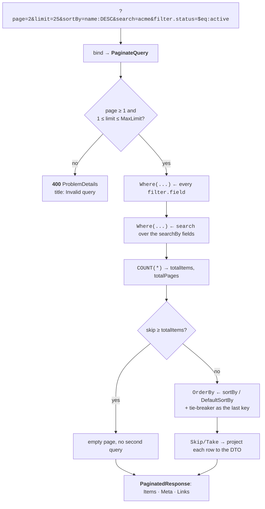

# Getting started

From nothing to a paginated, filterable, sortable JSON endpoint. The example is an ASP.NET Core Web API on
PostgreSQL; if you only want the engine, everything below except step 4 and step 5 still applies — see
[Pagination without ASP.NET Core](/recipes/without-aspnetcore/).

## Requirements

- **.NET 10** and **EF Core 10**. The packages are `net10.0`-only, and the major version tracks the framework
  they pair with: a `10.x` package goes with .NET 10.
- **Not trim-safe or Native-AOT-safe.** The engine builds expression trees and uses reflection, so every
  `Paginate*Async` entry point carries `[RequiresUnreferencedCode]` and `[RequiresDynamicCode]`. Publishing a
  trimmed or AOT app produces analyzer warnings, and those warnings are accurate — the annotations are there
  so you find out at build time rather than at run time.
- No database is required to *use* it: the engine works against any `IQueryable<T>`.

## 1. Install

```bash
dotnet add package Janzen.Pagination.EntityFrameworkCore
dotnet add package Janzen.Pagination.AspNetCore
dotnet add package Janzen.Pagination.PostgreSql
```

The core engine is the only required package — the other two are additive. `.AspNetCore` and `.PostgreSql`
both reference the core transitively, so installing either alone also works.

### Which `using` you need

| Namespace | For |
|-----------|-----|
| `Janzen.Pagination.EntityFrameworkCore` | the `Paginate*Async` entry points, `PaginateTypeSupport` |
| `Janzen.Pagination.EntityFrameworkCore.Configuration` | `PaginateConfig<T>`, `IPaginateConfigProvider<T>` |
| `Janzen.Pagination.EntityFrameworkCore.Model` | `PaginateQuery`, `PaginatedResponse<T>`, `PaginateFilterOperator`, `PaginateQueryException` |
| `Janzen.Pagination.EntityFrameworkCore.Links` | `PaginateLinkContext`, only when you build links yourself |
| `Janzen.Pagination.EntityFrameworkCore.DependencyInjection` | `AddPagination`, and **every** `AddAspNetCore` / `UsePostgreSql` / `UseNodaTime` — the add-ons declare into this one namespace on purpose, so registration reads the same whichever packages you installed |
| `Janzen.Pagination.AspNetCore` | `ToPaginateQuery()`, `AddPaginationLinkHeader()`, and the `HttpRequest` overloads of `Paginate*Async` |
| `Janzen.Pagination.AspNetCore.OpenApi` | `[PaginatedQuery<T>]`, `PaginatedQueryOperationTransformer` |

`WithPagination<T>()` needs no `using` at all: it is declared in `Microsoft.AspNetCore.Builder`, which a
Minimal API file already has.

## 2. The entity and the DTO

Nothing is required of the entity. The response DTO should be a **record** (or any type with a public
constructor): the automatic projection maps *constructor parameters*, not settable properties.

```csharp
public sealed class Product {
    public Guid Id { get; set; }
    public string Name { get; set; } = "";
    public string? Description { get; set; }
    public ProductStatus Status { get; set; }
    public decimal Price { get; set; }
    public DateTimeOffset CreatedAt { get; set; }
    public List<Review> Reviews { get; set; } = [];
}

public enum ProductStatus { Draft, Active, Discontinued }

// Parameter names are matched against Product members, case-insensitively.
public sealed record ProductDto(Guid Id, string Name, ProductStatus Status, decimal Price, DateTimeOffset CreatedAt);
```

## 3. Describe what clients may do

This is the whole contract. Anything not declared here is not addressable from the query string.

```csharp
using Janzen.Pagination.EntityFrameworkCore.Configuration;
using Janzen.Pagination.EntityFrameworkCore.Model;

public sealed class ProductPaginateConfigProvider : IPaginateConfigProvider<Product> {

    public readonly static PaginateConfig<Product> Config = PaginateConfig<Product>.Create(b => b
        .WithLimits(defaultLimit: 25, maxLimit: 100)

        // sortBy=name:ASC | price:DESC | createdAt:DESC
        .Sortable("name", p => p.Name)
        .Sortable("price", p => p.Price)
        .Sortable("createdAt", p => p.CreatedAt)
        .DefaultSortBy("createdAt", PaginateSortDirection.Desc)
        .WithTieBreaker(p => p.Id)          // unique key appended last → stable page boundaries

        // search=foo (and searchBy=name to narrow it)
        .Searchable("name", p => p.Name)
        .Searchable("description", p => p.Description)

        // filter.status=$eq:Active, filter.price=$btw:10,99.90, …
        .Filterable("status", p => p.Status, PaginateFilterOperator.Eq, PaginateFilterOperator.In)
        .Filterable("price", p => p.Price,
            PaginateFilterOperator.Eq, PaginateFilterOperator.GreaterThanOrEqual,
            PaginateFilterOperator.LessThanOrEqual, PaginateFilterOperator.Between)
        .Filterable("createdAt", p => p.CreatedAt,
            PaginateFilterOperator.GreaterThan, PaginateFilterOperator.LessThan, PaginateFilterOperator.Between));

    public PaginateConfig<Product> GetConfig() => Config;

}
```

Implementing `IPaginateConfigProvider<T>` is optional for querying — `PaginateAsync` takes the config directly —
but the OpenAPI integration resolves the documented parameters through the provider type, so it is the shape to
reach for in a web app. You only write the typed `GetConfig()`; the non-generic member is provided by a default
interface implementation.

## 4. Register

```csharp
// Program.cs
builder.Services.AddPagination(pagination => pagination
    .AddAspNetCore()     // query-string model binder + 400 ProblemDetails filter
    .UsePostgreSql());   // upgrade LIKE to native ILIKE

builder.Services.AddControllers();

// Optional: document the pagination parameters in the OpenAPI output.
using Janzen.Pagination.AspNetCore.OpenApi;
builder.Services.AddOpenApi(options =>
    options.AddOperationTransformer<PaginatedQueryOperationTransformer>());
```

## 5. The endpoint

```csharp
[ApiController]
[Route("products")]
public sealed class ProductController(AppDbContext db) : ControllerBase {

    [HttpGet]
    [PaginatedQuery<ProductPaginateConfigProvider>]   // documents the query parameters in OpenAPI
    public Task<PaginatedResponse<ProductDto>> List([FromQuery] PaginateQuery request, CancellationToken ct) =>
        db.Products.PaginateAsync<Product, ProductDto>(
            request, ProductPaginateConfigProvider.Config, this.Request, ct);

}
```

`[FromQuery] PaginateQuery` is bound by the model binder that `AddAspNetCore()` registered — you do not declare
`page`, `limit` and friends as action parameters. Passing `this.Request` is what makes the response carry
`first`/`prev`/`next`/`last` links; omit it and those are `null`.

The `Minimal API` equivalent is in [ASP.NET Core → Minimal APIs](/integrations/aspnetcore/#minimal-apis).

## 6. What comes back

```http
GET /products?page=2&limit=2&sortBy=price:DESC&filter.status=$eq:Active
```

```json
{
  "items": [
    { "id": "7f3c…", "name": "Widget Pro", "status": "Active", "price": 249.00, "createdAt": "2026-04-02T09:15:00+00:00" },
    { "id": "b1a9…", "name": "Widget",     "status": "Active", "price": 199.00, "createdAt": "2026-03-11T12:00:00+00:00" }
  ],
  "meta": {
    "totalItems": 37,
    "itemCount": 2,
    "itemsPerPage": 2,
    "totalPages": 19,
    "currentPage": 2
  },
  "links": {
    "first": "/products?limit=2&sortBy=price%3ADESC&filter.status=%24eq%3AActive&page=1",
    "previous": "/products?limit=2&sortBy=price%3ADESC&filter.status=%24eq%3AActive&page=1",
    "next": "/products?limit=2&sortBy=price%3ADESC&filter.status=%24eq%3AActive&page=3",
    "last": "/products?limit=2&sortBy=price%3ADESC&filter.status=%24eq%3AActive&page=19"
  }
}
```

`itemCount` is how many rows this page actually returned; `itemsPerPage` is the effective limit. Every field,
including when each link is `null` and what `meta` reports for a page past the end, is in
[Response contract](/reference/response/).

## What the engine does with that request



Two queries per request: one `COUNT(*)` over the filtered set, one page fetch. Asking for a page past the end
returns an empty `items` with the real `meta`, and skips the second query entirely.

## Next

- The complete wire format, operator by operator → **[Query-string contract](/reference/query-string/)**
- Everything the builder can declare → **[Configuration](../configuration/)**
- Sub-collections, aggregates, computed fields → **[Projections](../projections/)**
