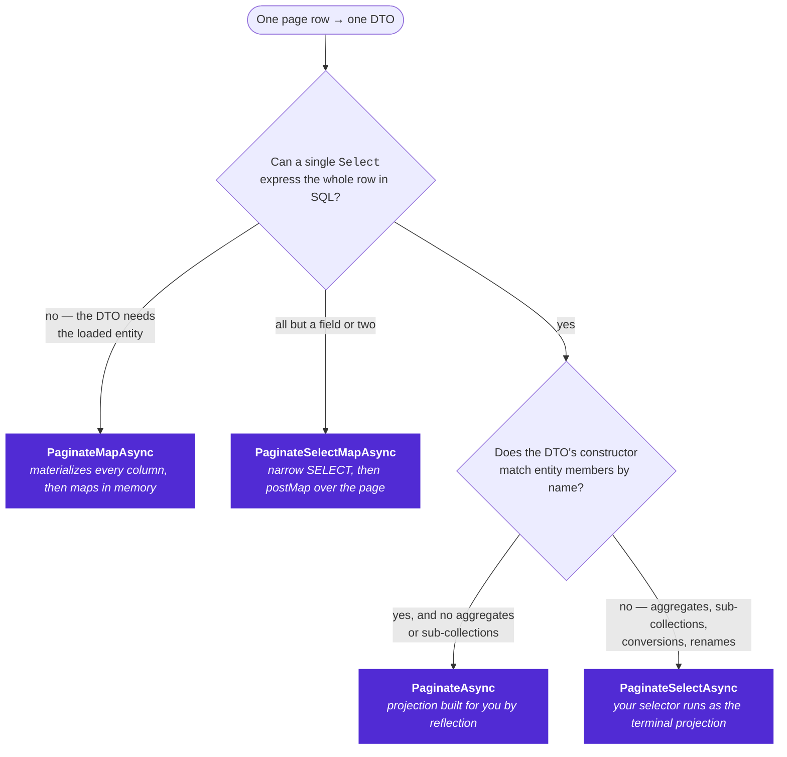

# Projections

Four entry points, one per projection strategy. They are deliberately **not overloads of one name**: the call
site should say which one it uses, and `Select` vs `Map` says where the work happens.

- `Select` → the shape is produced **in SQL**.
- `Map` → the shape is produced **in memory**, over the page rows.

## Picking one



| Strategy | Entry point | Runs where | Fetches |
|----------|-------------|------------|---------|
| Auto | `PaginateAsync<TEntity, TResult>(request, config)` | SQL | only the referenced columns |
| Selector | `PaginateSelectAsync<TEntity, TResult>(request, config, selector)` | SQL (+ shaper) | only the referenced columns |
| Selector + finalize | `PaginateSelectMapAsync<TEntity, TProjection, TResult>(request, config, selector, postMap)` | SQL, then in memory | only the referenced columns |
| Map | `PaginateMapAsync<TEntity, TResult>(request, config, projector)` | in memory | **every column of the entity** |

All four take an optional `PaginateLinkContext? linkContext = null` and `CancellationToken ct = default`; the
[ASP.NET Core](/integrations/aspnetcore/) package mirrors them with an `HttpRequest` parameter in place of the link
context.

### Type arguments

**`PaginateAsync` is the one that has to be written out**, and it is not a style choice: there is no lambda,
so nothing tells the compiler what `TResult` is. Naming one type argument is not enough either — name one and
you must name both. These are C# extension-block members, so the **entity comes first**:

```csharp
db.Products.PaginateAsync<Product, ProductDto>(request, config);
```

The other three take a lambda, which infers everything. The short form is the intended one:

```csharp
db.Products.PaginateSelectAsync(request, config, p => new ProductDto(p.Id, p.Name));
```

If you find yourself spelling out type arguments on those three, the lambda's return type is probably not
what you think it is.

---

## `PaginateAsync` — automatic projection

Builds the `Select` for you from the DTO's shape.

```csharp
public sealed record ProductDto(Guid Id, string Name, decimal Price, CategoryDto Category);
public sealed record CategoryDto(Guid Id, string Name);

var page = await db.Products.PaginateAsync<Product, ProductDto>(request, config, ct: ct);
```

### The rules it follows

1. It takes the DTO's **public constructor with the most parameters** — so records and positional constructors.
   **Settable properties are not used.** This is by design, not an omission: a constructor is a complete,
   compiler-checked description of the shape.
2. Each constructor parameter name is matched against a public **property or field** on the source type,
   case-insensitively.
3. If the types are assignable (including `T` → `T?`), the member is used directly.
4. Otherwise a registered conversion is tried — that is how `Instant` → `DateTimeOffset` works when the
   [`.NodaTime`](/integrations/nodatime/) package is installed.
5. Otherwise, if the target is a *simple* type (primitive, `string`, `enum`, `Guid`, `decimal`, `DateTime`,
   `DateTimeOffset`, or a registered one) it fails — there is nothing sensible to do.
6. Otherwise it recurses: the target is treated as a nested DTO and built from the source member the same way.
   A nullable source member becomes a null-propagating conditional; a nullable source into a **non-nullable**
   target parameter fails.

### What it cannot do

Sub-collections, aggregates (`Count`, `Sum`), renames, filters inside a projection, or anything computed. All
of those are `PaginateSelectAsync` territory.

Failures are `InvalidOperationException` with the path that broke, e.g.:

> Cannot automatically project 'Product.Sku' from 'String' to 'Int32'.

The projection is built lazily and cached per `(TEntity, TResult)` pair, so a mismatch surfaces the **first
time the endpoint is called**, not at startup. Worth one smoke test per DTO.

---

## `PaginateSelectAsync` — your selector, in SQL

```csharp
var page = await db.Products.PaginateSelectAsync(request, config, p => new ProductSummary(
    p.Id,
    p.Name,
    p.Reviews.Count,                                        // aggregate
    p.Reviews.Average(r => (double?)r.Rating) ?? 0,         // aggregate
    p.Reviews
        .OrderByDescending(r => r.PostedAt)
        .Take(3)
        .Select(r => new ReviewDto(r.Id, r.Reviewer, r.Rating))
        .ToList()                                           // sub-collection
), ct: ct);
```

The selector becomes the query's **terminal projection**, which is what makes this both flexible and cheap:
the `SELECT` lists only the columns the selector mentions (an unused `jsonb` blob is never read), and EF Core
may evaluate individual non-translatable leaves in the shaper — client-side, over the page rows only — while
everything else runs in SQL.

### Sub-collections and NodaTime in one query

Because of that shaper behaviour, a DTO that mixes one-to-many sub-collections **with**
`Instant` → `DateTimeOffset` conversions — even *inside* the sub-collection items — still executes as a single
query. It does not need `PaginateMapAsync`:

```csharp
await db.Products.PaginateSelectAsync(request, config, p => new ProductSummary(
    p.Id,
    p.Name,
    p.ReleasedAt.ToDateTimeOffset(),                                        // Instant  → DateTimeOffset
    p.DiscontinuedAt.HasValue                                               // Instant? → DateTimeOffset?
        ? p.DiscontinuedAt.Value.ToDateTimeOffset()
        : (DateTimeOffset?)null,
    p.Reviews.Select(r => new ReviewDto(
        r.Id, r.Reviewer, r.PostedAt.ToDateTimeOffset())).ToList()          // conversion inside the collection
), ct: ct);
```

`Instant` and `DateTimeOffset` are the same UTC instant on the wire (both map to `timestamptz`), so
`ToDateTimeOffset()` has no SQL form to translate — it is a free CLR reinterpret the shaper applies. That is a
feature of the terminal projection, not a fallback.

---

## `PaginateSelectMapAsync` — SQL, then finish in memory

For the case where nearly everything translates but one field needs real CLR code: a weighted average with a
divide-by-zero guard, bespoke rounding, a formatted string.

Project the flat fields **plus the raw ingredients** in SQL, then finish them:

```csharp
private sealed record Row(Guid Id, string Name, int RatingSum, int RatingCount);

var page = await db.Products.PaginateSelectMapAsync(request, config,
    selector: p => new Row(p.Id, p.Name, p.Reviews.Sum(r => r.Rating), p.Reviews.Count),
    postMap:  row => new ProductSummary(
        row.Id,
        row.Name,
        row.RatingCount == 0 ? null : Math.Round(row.RatingSum / (double)row.RatingCount, 1)),
    ct: ct);
```

The `SELECT` stays exactly as narrow as the selector, and `postMap` runs only over the current page —
O(page size), not O(table).

---

## `PaginateMapAsync` — the full entity, mapped in memory

```csharp
var page = await db.Products.PaginateMapAsync(request, config,
    product => ProductDto.FromEntity(product, _pricingService), ct: ct);
```

This materializes **every column of every page entity** and then maps them. Reach for it only when the mapping
genuinely needs the loaded entity — an existing hand-written mapper you cannot express as an expression, or
logic that calls into services.

The page entities are loaded with `AsNoTracking` (applied automatically on real EF providers), so a read-only
list does not pollute the change tracker. That is unconditional, and `AsNoTracking` is a query-level operator
applied last — so it **overrides** an `AsTracking()` on the source query. An entity your `projector` reaches is
therefore not tracked, and mutating it will not be persisted by `SaveChanges`.

**Not a reason to use it:** a projection that combines sub-collections with NodaTime conversions. That is
`PaginateSelectAsync`, which keeps the `SELECT` narrow.

---

## Cost, in one table

For a page of 25 rows out of a million:

| | rows scanned | columns read | client-side work |
|---|---|---|---|
| `PaginateAsync` | 25 (+ index for the count) | those the DTO names | none |
| `PaginateSelectAsync` | 25 | those the selector names | non-translatable leaves only |
| `PaginateSelectMapAsync` | 25 | those the selector names | `postMap` × 25 |
| `PaginateMapAsync` | 25 | **all** | `projector` × 25 |

The choice of strategy does not change the number of queries — see
[Getting started](../getting-started/#what-the-engine-does-with-that-request) for the shape all four share.

Change tracking is the one column that table cannot hold, because only one strategy decides it for you.
`PaginateMapAsync` reads the page with `AsNoTracking` whatever the source says; the `Select` family adds
nothing and therefore tracks whatever entity instances the selector returns — `p => p` tracks the page,
`p => new { p.Id, p.Category }` tracks the categories, and a selector naming only scalars tracks nothing.
That is your `IQueryable` and your call: put `AsNoTracking()` on the source when you do not want it.

All four are also annotated `[RequiresUnreferencedCode]` and `[RequiresDynamicCode]`, because projection is
exactly the part that needs reflection: see
[Requirements](../getting-started/#requirements).

## Threading and cancellation

The four entry points and the two composers split their errors the way the .NET task pattern asks them to, and
this is the contract, not an implementation detail:

- **An argument error is raised at the call.** A `null` `source`, `request`, `config`, `selector`, `postMap` or
  `projector` throws `ArgumentNullException` from the call itself, before a task exists. Code that builds a
  batch of pages — `tenants.Select(t => t.Products.PaginateSelectAsync(…)).ToArray()` and then a `Task.WhenAll`
  — therefore fails at the `ToArray()`, with the sibling tasks already created and not awaited. Validate the
  arguments before the fan-out, or build it one page at a time.
- **A request error is delivered through the task.** Everything the caller sent — `page`, `limit`, `sortBy`,
  `search`, `searchBy`, every `filter.…` — becomes a faulted task carrying `PaginateQueryException`, which is
  what the [ASP.NET Core](/integrations/aspnetcore/) filters translate into a `400`.
- **The cancellation token is read first and read again.** It is checked before the request is even validated,
  so a cancelled caller gets `OperationCanceledException` rather than a `400` for a request nobody is waiting
  for, and again once the rows are in memory — so a `postMap` or a `projector` does not run over a page whose
  client has gone away. Pass the token: in MVC and in Minimal APIs a `CancellationToken` parameter binds to
  `HttpContext.RequestAborted` for free, and the engine has no other way to learn the request was abandoned.
- **Which thread `postMap` and `projector` run on follows the leg.** On the Entity Framework Core leg the
  engine awaits with `ConfigureAwait(false)`, so they continue on a thread-pool thread with no synchronization
  context — do not touch UI-affine state in them. On the in-memory leg there is no await at all, because
  `ToArray()` is synchronous, so they run inline on the calling thread with whatever context it carries.
  `AsyncLocal` values reach them on both legs: `ConfigureAwait(false)` suppresses the synchronization context,
  not the execution context that `AsyncLocal` flows on. Do not block in them either way.
- **A source that is not an EF Core queryable executes synchronously.** The engine has two legs: Entity
  Framework Core's, and an in-memory one for a plain `IQueryable` such as `List<T>.AsQueryable()`. On the
  in-memory leg the terminal operators are `Count()` and `ToArray()`, which run on the calling thread — fine for
  a test, not something to put on a request path. A provider that is asynchronous *without* being EF Core's —
  what a queryable-shaped mocking library produces — is neither leg and is refused with a `PaginateQueryException`
  saying so; test against a real provider instead, as [Testing](/recipes/testing/) shows.
