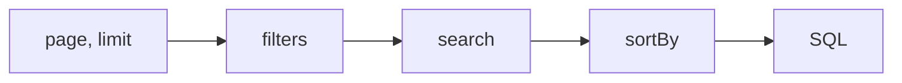

# Error catalogue

Every message a caller can provoke. All of them are one exception type, `PaginateQueryException`, which the
ASP.NET Core integration turns into `400 Bad Request` with `title: "Invalid query"` and the message as
`detail` — see [ASP.NET Core → Errors](/integrations/aspnetcore/#errors-as-problemdetails) for the wire shape.

The messages are part of the published contract and are written to be safe to show a caller: they name the
field and the operator, never a column, a table, a CLR type or an inner exception. An echoed value is
truncated and stripped of control characters before it reaches the message.

Every row below also carries a **code** — the `PaginateQueryError` member the engine rejected with, emitted
as the `code` member of the 400 payload. Branch on the code, not on the prose: the prose is contract but it
is English, and one code stands for several messages. See
[ASP.NET Core → Errors](/integrations/aspnetcore/#errors-as-problemdetails) for where it lands on the wire.

## Which error wins

A request can be wrong in several ways at once, and only one message comes back. The order is the order the
engine works in, and it is fixed:

So a request with both a bad `page` and an unknown filter field reports the `page` problem, and fixing that
reveals the next one. Validation finishes before the database is touched, so a rejected request costs no
query at all — **with one exception**, marked in the table below: the `AllowUnlimited` row ceiling is the
only refusal the engine raises *after* the database has answered, because the row count it guards is not
knowable before the rows arrive. It is bounded at `maxRows + 1` rows, never the whole match set.

That holds whatever the request would have returned. A `sortBy` naming a field the config does not have is a
`400` even when the filters match nothing, and even past the last page — cases with no rows to order, and
therefore the ones where a validation gap is least likely to be noticed.

Errors are grouped below in that same order.

---

## Paging

| Message | `code` | Triggered by | Fix |
|---------|--------|--------------|-----|
| `Query parameter 'page' must be a positive integer.` | `PageOutOfRange` | `page` that is not a plain positive integer — `0`, `-1`, `+2`, `2.0`, `abc`. Leading zeros **are** accepted: `?page=007` is page 7 | pages are 1-based; send `1` for the first page |
| `Query parameter 'limit' must be a positive integer.` | `LimitOutOfRange` | the same forms in `limit` — with one carve-out, the literal `-1`, which a resource may accept (see [`AllowUnlimited`](../configuration/#allowunlimited)) and every other resource then answers with the range message below | send a whole number, or omit `limit` to get the configured default |
| `Query parameter 'limit' must be between 1 and N.` | `LimitOutOfRange` | `limit` above the config's `MaxLimit`, **or** a `limit` of `0` or less supplied directly on a `PaginateQuery` rather than over the wire | ask for at most `N`; the engine **rejects rather than clamps**, so a smaller number is not silently substituted |
| `Query parameter 'page' exceeds the allowed offset for this resource: at most N rows may be skipped.` | `MaxOffsetExceeded` | `(page - 1) × limit` above the config's [`WithMaxOffset`](../configuration/#withmaxoffset) | ask for an earlier page, or a larger `limit` to reach the same rows with a smaller offset. Raised before the count, so a guarded deep page costs no query at all |
| `Query parameter 'page' must be 1 when 'limit' is -1.` | `UnlimitedReadRequiresFirstPage` | `limit=-1` with any other page | an unlimited read is a single page by definition |
| `The unlimited read is too large: this resource returns at most N rows for 'limit=-1'.` | `UnlimitedReadTooLarge` | more matching rows than the ceiling passed to [`AllowUnlimited`](../configuration/#allowunlimited). **The one refusal raised after the database has answered** | narrow the filters, or page normally |

The two "positive integer" messages are produced during model binding but **deferred**: the binder records
the problem and never fails the bind, so the request reaches your action and the `400` is raised when
pagination runs. That is what keeps a malformed `page` from turning into a framework-shaped model-state error
that looks nothing like the rest of this catalogue.

`UnlimitedReadTooLarge` is unlike every other row here: it is a **capacity refusal about the resource, not a
defect in the request**, and the ordered query has already run — bounded at `maxRows + 1` rows — by the time
it is raised. A monitor that splits 4xx from 5xx files it as caller error; treat a rising count as a signal
to raise the `AllowUnlimited` ceiling or to narrow the resource, not as clients misbehaving. Clients that
never retry a 4xx stop permanently.

---

## Filters

### Filter dispatch

| Message | `code` | Triggered by | Fix |
|---------|--------|--------------|-----|
| `Filter for field 'x' is not configured.` | `FilterFieldNotConfigured` | `filter.x` where `x` was never declared `Filterable` / `FilterableMany` — **or** was declared and disabled for this caller by [`.When(false)`](../configuration/#when) | check the spelling; a disabled field reads the same way, so see the note below |
| `Filter for field 'x' repeats 'y'; combine the criteria in one entry.` | `DuplicateFilterField` | two entries of a directly-constructed `PaginateQuery` resolving to the same configured field, which would silently `AND` and match nothing. Not reachable over HTTP — ASP.NET Core folds query keys case-insensitively first | put every criterion for one field in that field's single entry |
| `Too many filter conditions; at most N are allowed.` | `TooManyFilterConditions` | more `filter.*` values than `MaxFilterConditions`, **counted across every field** | combine criteria, or raise the ceiling with [`WithGuards`](../configuration/#withguards) |
| `Filter 'x' must not begin with '$or'; a connector joins a criterion to the one before it.` | `FilterConnectorMisplaced` | a field's **first** criterion carrying `$and:` or `$or:`, which has nothing to join to — the shape a client that prefixes every criterion uniformly sends | drop the connector from the first criterion of each field; see [`$and` / `$or`](../query-string/#and-or-—-combining-criteria-on-one-field) |

A field hidden by `.When(false)` reports **exactly** the message of a field that does not exist, so the
*error* discloses nothing. That is deliberate — but it is not a non-disclosure primitive on its own: a
conditional field stays listed in the generated OpenAPI document with its badge, [by
design](../configuration/#when), so the separation holds only where that document is not published to the
callers the condition excludes. Do not treat `.When(false)` as access control; it hides a field from the
request surface, not from the description of it.

Repeated keys that differ only in case (`filter.Status` and `filter.status`) land on **one field**, which is
what the folding buys. They are not free: every criterion value still counts as one condition, so
`?filter.Status=$eq:Active&filter.status=$eq:Draft` consumes two.

### Filter parsing

| Message | `code` | Triggered by | Fix |
|---------|--------|--------------|-----|
| `Filter 'x' must not be empty.` | `FilterCriterionMalformed` | `?filter.x=` with nothing after the `=` | send `$op:value`, or drop the parameter |
| `Filter 'x' uses unknown operator '$foo'.` | `FilterOperatorUnknown` | a `$token` that is not one of the eleven operators | see the [operator reference](../query-string/#operator-reference) |
| `Filter 'x' must use the format '$operator:value'.` | `FilterCriterionMalformed` | no operator token at all, or an operator other than `$null` sent bare | every operator except `$null` needs a value |
| `Filter 'x' does not take a value for '$null'.` | `FilterCriterionMalformed` | **any colon after the token** — `$null:false`, `$null:true`, and a bare trailing `$null:` with nothing behind it | `$null` is valueless; write it as `$null`, and `$not:$null` is how you ask for the opposite |

The last two are the same rule read from both ends: every operator except `$null` needs a value, and `$null`
refuses one. A value used to be parsed and then dropped, so `$null:false` quietly selected the rows it reads
as excluding.

### Filter operators

Raised once the operator is known and is being applied to the field. Three of these describe an
operator the field's type cannot carry; a configuration declaring one no longer builds, so they survive
only as engine-internal backstops and no query string reaches them.

| Message | `code` | Triggered by | Fix |
|---------|--------|--------------|-----|
| `Filter 'x' does not support operator '$foo'.` | `FilterOperatorNotAllowed` | a real operator that was not whitelisted **for that field** | the allow-list is per field; grant it in [`Filterable`](../configuration/#filterable) if it belongs there |
| `Filter 'x' requires at least one '$in' value.` | `FilterValueCountInvalid` | `$in:` with an empty list | `$in` needs one or more comma-separated values |
| `Filter 'x' requires exactly two '$btw' values.` | `FilterValueCountInvalid` | `$btw` with one value, or three or more | `$btw:20,50`; the bounds are inclusive |
| `Filter 'x' requires at least one '$contains' value.` | `FilterValueCountInvalid` | `$contains:` on a collection field with an empty list | supply the values the collection must hold |
| `Filter 'x' supports '$contains' only for string or collection fields.` | `FilterOperatorTypeMismatch` | `$contains` granted to a number, date or enum field. Not reachable from a request: [`Build()`](../configuration/#filterable) refuses that declaration | use `$eq` or `$in` on a scalar |
| `Filter 'x' supports string pattern operators only for string fields.` | `FilterOperatorTypeMismatch` | `$sw` or `$ilike` granted to a non-string field. Not reachable from a request: [`Build()`](../configuration/#filterable) refuses that declaration | pattern matching needs a `string` selector |
| `Filter 'x' does not support operator '$eq' for type 'T'.` | `FilterOperatorTypeMismatch` | `$eq` against a type that defines no equality operator — a plain `struct` registered through [`PaginateTypeSupport`](/integrations/custom-types/), where the compiler writes none. A `record struct` gets one and is unaffected | use `$in`, which compares through `EqualityComparer<T>.Default`, or give the type an `==` operator |
| `Filter 'x' does not support comparison operators for type 'T'.` | `FilterOperatorTypeMismatch` | `$lt`/`$lte`/`$gt`/`$gte`/`$btw` granted to a type with no ordering — `bool`, and any type registered through [`PaginateTypeSupport`](/integrations/custom-types/) that defines no comparison operators. Not reachable from a request: [`Build()`](../configuration/#filterable) refuses that declaration | there is nothing to order; use `$eq` or `$in`. Numbers, dates, `string`, `Guid` and enums all compare — see [comparisons](../query-string/#lt-lte-gt-gte-—-comparisons) |
| `Filter 'x' pattern must be at least N characters.` | `FilterPatternTooShort` | `$ilike`, `$sw` or a string `$contains` whose value is shorter than [`WithMinSearchLength`](../configuration/#withminsearchlength) — a zero-length one included | the same guard `search` obeys: those three emit the identical `LIKE` and are measured the same way |
| `Filter 'x' pattern must not exceed N characters.` | `FilterPatternTooLong` | the same three operators with a value longer than `MaxSearchLength` | shorten the pattern, or raise the ceiling with [`WithGuards`](../configuration/#withguards) |
| `Filter 'x' accepts at most N values.` | `TooManyFilterValues` | one list longer than `MaxFilterValues` | the ceiling is **per criterion**, so splitting a huge `$in` across two criteria of the same field is a legitimate workaround; raising it is [`WithGuards`](../configuration/#withguards) |
| `Filter operator '<member>' is not supported.` | `FilterOperatorUnsupported` | an operator with no implementation behind it. Every current member has one, so no query string can reach this — it is an engine-internal guard, and it names the **enum member** rather than a `$token` for exactly that reason | not reachable from a request; treat it as a bug report |

### Value conversion

Raised when the text after the operator cannot become the field's CLR type. See
[value formats](../query-string/#value-formats) for what each type accepts.

| Message | `code` | Triggered by | Fix |
|---------|--------|--------------|-----|
| `Value 'v' is not valid for 'x'.` | `ValueInvalid` | unparseable text, a number that overflows or saturates the type, a `NaN` / infinite float, an enum sent **numerically** or as a comma list, or an enum name that is not a defined member | enums are matched by one declared name, case-insensitively; see [value formats](../query-string/#value-formats) |
| `Value 'v' is not a valid GUID.` | `ValueInvalid` | text that `Guid.TryParse` rejects | any format `Guid.TryParse` accepts is fine |
| `Value 'v' is not a valid boolean.` | `ValueInvalid` | anything but `true` / `false`, case-insensitively | `1` and `0` are **not** accepted |
| `Value 'v' is not valid for 'x': a duration in years or months has no fixed length.` | `ValueInvalid` | `P1M` or `P1Y` — any ISO-8601 duration carrying `Y` or `M` in its date part — on a `TimeSpan` field. **Core package**, no add-on needed | express the span in days or smaller; a month is not a fixed length |
| `Value 'v' is not a valid <type>.` | `ValueInvalid` | a parse failure on a NodaTime field. `<type>` is one of **instant · local date · local date-time · local time · offset date-time · year-month · duration** — the seven types [`UseNodaTime()`](/integrations/nodatime/) registers | requires the [`.NodaTime` package](/integrations/nodatime/); per-type formats are on that page |
| `Value 'v' is not a valid duration: a duration in years or months has no fixed length.` | `ValueInvalid` | the same `Y`/`M` refusal on a NodaTime `Duration` field | as above — one rule, two packages, each keeping its own wording |
| `Value for 'x' must not be empty.` | `ValueEmpty` | an empty or whitespace-only value against a **non-nullable** target that is not `string`. A nullable target reads it as `null` instead, and `string` takes it verbatim | send a value, or use `$null` |
| `Filter 'x' requires a value; use '$null' to match rows with no value.` | `ValueEmpty` | an empty or whitespace-only value on a filter criterion (`?filter.price=$eq:`), before conversion runs | send a value, or `$null` — which the field has to whitelist, exactly as any other operator does |
| `Filtering values for 'x' is not supported.` | `ValueInvalid` | a field whose CLR type has no registered parser, no built-in arm and no `IParsable<TSelf>` | register one with [`PaginateTypeSupport`](/integrations/custom-types/) |

---

## Search

| Message | `code` | Triggered by | Fix |
|---------|--------|--------------|-----|
| `Search term must not exceed N characters.` | `SearchTermTooLong` | `search` longer than `MaxSearchLength` | checked before the query is built, so a long term costs nothing |
| `Search term must be at least N characters.` | `SearchTermTooShort` | `search` shorter than [`WithMinSearchLength`](../configuration/#withminsearchlength) | measured **after trimming**, so padding does not get a short term past it. A term that is empty or all whitespace is **no search at all** — neither guard runs and `meta.search` is `null` |
| `Search is not configured for this resource.` | `SearchNotConfigured` | `search` sent to a config that declares no `Searchable` field | the resource has no free-text surface; filter instead |
| `Search for field 'x' is not configured.` | `SearchFieldNotConfigured` | a `searchBy` naming a field that is not `Searchable` | `searchBy` narrows the existing search set, it cannot add to it |
| `Search field 'x' is specified more than once.` | `DuplicateSearchField` | the same `searchBy` value repeated | send each field once |

`searchBy` is validated **even when `search` is absent**. A request carrying only `?searchBy=nonsense` is
rejected rather than ignored, so a client cannot ship a typo that silently does nothing until the day someone
adds a search term.

With [`IgnoreSearchByInQueryParam()`](../configuration/#ignoresearchbyinqueryparam) the parameter
leaves the contract entirely: it is then neither applied nor validated, and none of these three `searchBy`
messages can occur.

---

## Sorting

| Message | `code` | Triggered by | Fix |
|---------|--------|--------------|-----|
| `Sort value 'x' must use the format 'field:ASC' or 'field:DESC'.` | `SortValueMalformed` | a `sortBy` value missing the `:direction` half | the direction is not optional |
| `Sort direction 'x' is not supported.` | `SortDirectionUnknown` | a direction that is neither `ASC` nor `DESC` (case-insensitive) | no `asc nulls last` or similar |
| `Too many sort fields; at most N are allowed.` | `TooManySortFields` | more `sortBy` values than `MaxSortFields` | only request-supplied sorts count — defaults and the tie-breaker do not |
| `Sort for field 'x' is not configured.` | `SortFieldNotConfigured` | a name that was never declared `Sortable`, or is disabled by `.When(false)` | same rule as filters — identical message, and the same OpenAPI caveat |
| `Sort field 'x' is specified more than once.` | `DuplicateSortField` | the same `sortBy` field repeated, whatever the directions | send each field once; the same rule as `searchBy`, so a typo cannot silently order by nothing |

There is no longer an error for "this resource cannot be ordered". `WithTieBreaker` is required at
configuration time (see [`WithTieBreaker`](../configuration/#withtiebreaker)), so a config that could not
order does not build — which means it cannot reach a request. That refusal used to be a `400`, and reporting
a configuration defect as a client error is what moved it.

---

## What is *not* a 400

Projection failures throw `InvalidOperationException`, not `PaginateQueryException`, so they are **not**
caught by the ProblemDetails filter and surface as `500`. That is on purpose: no query string can cause them,
and the fix is always a code change.

They come from automatic projection — [`PaginateAsync`](/guide/projections/) — when the target type cannot be
built from the entity: no usable constructor, a constructor parameter with no matching source member, or a
member the projection cannot translate. Projection DTOs should be records; see
[Projections](/guide/projections/) for the rules the builder follows.

The same is true of the configuration-time exceptions in
[Configuration API](../configuration/#create-and-what-it-defers) — they fire when the config is
built, long before any request exists.

**Nor is an untranslatable filter.** Everything above is a refusal the *library* makes; whether a predicate
the library built can become SQL is the **provider's** decision, and a provider that cannot translate one
throws its own `InvalidOperationException` ("The LINQ expression … could not be translated"), which is a
`500`. The derived operator set hands the whole range family to every ordered type, so
`.Filterable("createdAt", p => p.CreatedAt)` advertises `$gt` in the generated document and it works on
PostgreSQL and SQL Server — while the SQLite provider refuses `DateTimeOffset` and `TimeSpan` comparisons
outright, with or without this library in the picture. "Translatable" is a property of your provider, not of
the operator; if a filter is offered to callers, exercise it against the provider you deploy on.
