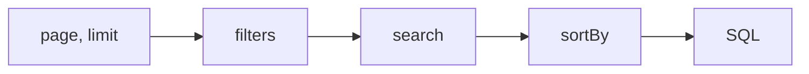

# Error catalogue

Every message a caller can provoke. All of them are one exception type, `PaginateQueryException`, which the
ASP.NET Core integration turns into `400 Bad Request` with `title: "Invalid query"` and the message as
`detail` — see [ASP.NET Core → Errors](/integrations/aspnetcore/#errors-as-problemdetails) for the wire shape.

The messages are part of the published contract and are written to be safe to show a caller: they name the
field and the operator, never a column, a table or an inner exception.

## Which error wins

A request can be wrong in several ways at once, and only one message comes back. The order is the order the
engine works in, and it is fixed:

So a request with both a bad `page` and an unknown filter field reports the `page` problem, and fixing that
reveals the next one. Validation finishes before the database is touched, so a rejected request costs no
query at all.

That holds whatever the request would have returned. A `sortBy` naming a field the config does not have is a
`400` even when the filters match nothing, and even past the last page — cases with no rows to order, and
therefore the ones where a validation gap is least likely to be noticed.

Errors are grouped below in that same order.

---

## Paging

| Message | Triggered by | Fix |
|---------|--------------|-----|
| `Query parameter 'page' must be a positive integer.` | `page` that is not a plain positive integer — `0`, `-1`, `+2`, `2.0`, `abc` | pages are 1-based; send `1` for the first page |
| `Query parameter 'limit' must be a positive integer.` | the same forms in `limit` — with one carve-out, the literal `-1`, which a resource may accept (see [`AllowUnlimited`](../configuration/#allowunlimited)) and every other resource then answers with the range message below | send a whole number, or omit `limit` to get the configured default |
| `Query parameter 'limit' must be between 1 and N.` | `limit` above the config's `MaxLimit` | ask for at most `N`; the engine **rejects rather than clamps**, so a smaller number is not silently substituted |
| `Query parameter 'page' exceeds the allowed offset for this resource: at most N rows may be skipped.` | `(page - 1) × limit` above the config's [`WithMaxOffset`](../configuration/#withmaxoffset) | ask for an earlier page, or a larger `limit` to reach the same rows with a smaller offset. Raised before the count, so a guarded deep page costs no query at all |
| `Query parameter 'page' must be 1 when 'limit' is -1.` | `limit=-1` with any other page | an unlimited read is a single page by definition |
| `The unlimited read is too large: this resource returns at most N rows for 'limit=-1'.` | more matching rows than the ceiling passed to [`AllowUnlimited`](../configuration/#allowunlimited) | narrow the filters, or page normally |

The two "positive integer" messages are produced during model binding but **deferred**: the binder records
the problem and never fails the bind, so the request reaches your action and the `400` is raised when
pagination runs. That is what keeps a malformed `page` from turning into a framework-shaped model-state error
that looks nothing like the rest of this catalogue.

---

## Filters

### Filter dispatch

| Message | Triggered by | Fix |
|---------|--------------|-----|
| `Filter for field 'x' is not configured.` | `filter.x` where `x` was never declared `Filterable` / `FilterableMany` — **or** was declared and disabled for this caller by [`.When(false)`](../configuration/#when) | check the field name against the OpenAPI parameter list |
| `Too many filter conditions; at most N are allowed.` | more `filter.*` values than `MaxFilterConditions`, **counted across every field** | combine criteria, or raise the ceiling with [`WithGuards`](../configuration/#withguards) |

A field hidden by `.When(false)` reports **exactly** the message of a field that does not exist. This is
deliberate non-disclosure, not a missing case: a caller without permission cannot tell an admin-only field
from a typo.

Repeated keys that differ only in case (`filter.Status` and `filter.status`) are folded together before
counting, so they do not each consume a condition.

### Filter parsing

| Message | Triggered by | Fix |
|---------|--------------|-----|
| `Filter 'x' must not be empty.` | `?filter.x=` with nothing after the `=` | send `$op:value`, or drop the parameter |
| `Filter 'x' uses unknown operator '$foo'.` | a `$token` that is not one of the eleven operators | see the [operator reference](../query-string/#operator-reference) |
| `Filter 'x' must use the format '$operator:value'.` | no operator token at all, or an operator other than `$null` sent bare | every operator except `$null` needs a value |
| `Filter 'x' does not take a value for '$null'.` | `$null:false`, `$null:true` — anything after the token | `$null` is valueless; `$not:$null` is how you ask for the opposite |

The last two are the same rule read from both ends: every operator except `$null` needs a value, and `$null`
refuses one. A value used to be parsed and then dropped, so `$null:false` quietly selected the rows it reads
as excluding.

### Filter operators

Raised once the operator is known and is being applied to the field.

| Message | Triggered by | Fix |
|---------|--------------|-----|
| `Filter 'x' does not support operator '$foo'.` | a real operator that was not whitelisted **for that field** | the allow-list is per field; grant it in [`Filterable`](../configuration/#filterable) if it belongs there |
| `Filter 'x' requires at least one '$in' value.` | `$in:` with an empty list | `$in` needs one or more comma-separated values |
| `Filter 'x' requires exactly two '$btw' values.` | `$btw` with one value, or three or more | `$btw:20,50`; the bounds are inclusive |
| `Filter 'x' requires at least one '$contains' value.` | `$contains:` on a collection field with an empty list | supply the values the collection must hold |
| `Filter 'x' supports '$contains' only for string or collection fields.` | `$contains` against a number, date or enum field | use `$eq` or `$in` on a scalar |
| `Filter 'x' supports string pattern operators only for string fields.` | `$sw` or `$ilike` against a non-string field | pattern matching needs a `string` selector |
| `Filter 'x' does not support operator '$eq' for type 'T'.` | `$eq` against a type that defines no equality operator — a plain `struct` registered through [`PaginateTypeSupport`](/integrations/custom-types/), where the compiler writes none. A `record struct` gets one and is unaffected | use `$in`, which compares through `EqualityComparer<T>.Default`, or give the type an `==` operator |
| `Filter 'x' does not support comparison operators for type 'T'.` | `$lt`/`$lte`/`$gt`/`$gte`/`$btw` against a type with no ordering — `bool`, and any type registered through [`PaginateTypeSupport`](/integrations/custom-types/) that defines no comparison operators | there is nothing to order; use `$eq` or `$in`. Numbers, dates, `string`, `Guid` and enums all compare — see [comparisons](../query-string/#lt-lte-gt-gte-—-comparisons) |
| `Filter 'x' accepts at most N values.` | one list longer than `MaxFilterValues` | the ceiling is **per criterion**, so splitting a huge `$in` across two criteria of the same field is a legitimate workaround; raising it is [`WithGuards`](../configuration/#withguards) |
| `Filter operator '<member>' is not supported.` | an operator with no implementation behind it. Every current member has one, so no query string can reach this — it is an engine-internal guard, and it names the **enum member** rather than a `$token` for exactly that reason | not reachable from a request; treat it as a bug report |

### Value conversion

Raised when the text after the operator cannot become the field's CLR type. See
[value formats](../query-string/#value-formats) for what each type accepts.

| Message | Triggered by | Fix |
|---------|--------------|-----|
| `Value 'v' is not valid for type 'T'.` | unparseable text, a number that overflows the type, an enum sent **numerically**, or an enum name that is not a defined member | enums are matched by name only, case-insensitively |
| `Value 'v' is not a valid GUID.` | text that `Guid.TryParse` rejects | any format `Guid.TryParse` accepts is fine |
| `Value 'v' is not a valid boolean.` | anything but `true` / `false`, case-insensitively | `1` and `0` are **not** accepted |
| `Value 'v' is not a valid instant.` / `local date.` | an ISO-8601 failure on a NodaTime field | requires the [`.NodaTime` package](/integrations/nodatime/) |
| `Filter 'x' requires a value; use '$null' to match rows with no value.` | an empty or whitespace-only value on any non-`string` field (`?filter.price=$eq:`) | send a value, or `$null` — which the field has to whitelist, exactly as any other operator does |
| `Filtering values of type 'T' is not supported.` | a field whose CLR type has no registered parser | register one with [`PaginateTypeSupport`](/integrations/custom-types/) |

---

## Search

| Message | Triggered by | Fix |
|---------|--------------|-----|
| `Search term must not exceed N characters.` | `search` longer than `MaxSearchLength` | checked before the query is built, so a long term costs nothing |
| `Search term must be at least N characters.` | `search` shorter than [`WithMinSearchLength`](../configuration/#withminsearchlength) | measured **after trimming**, so padding does not get a short term past it |
| `Search is not configured for this resource.` | `search` sent to a config that declares no `Searchable` field | the resource has no free-text surface; filter instead |
| `Search for field 'x' is not configured.` | a `searchBy` naming a field that is not `Searchable` | `searchBy` narrows the existing search set, it cannot add to it |
| `Search field 'x' is specified more than once.` | the same `searchBy` value repeated | send each field once |

`searchBy` is validated **even when `search` is absent**. A request carrying only `?searchBy=nonsense` is
rejected rather than ignored, so a client cannot ship a typo that silently does nothing until the day someone
adds a search term.

With [`IgnoreSearchByInQueryParam()`](../configuration/#ignoresearchbyinqueryparam) the parameter
leaves the contract entirely: it is then neither applied nor validated, and none of these three `searchBy`
messages can occur.

---

## Sorting

| Message | Triggered by | Fix |
|---------|--------------|-----|
| `Sort value 'x' must use the format 'field:ASC' or 'field:DESC'.` | a `sortBy` value missing the `:direction` half | the direction is not optional |
| `Sort direction 'x' is not supported.` | a direction that is neither `ASC` nor `DESC` (case-insensitive) | no `asc nulls last` or similar |
| `Too many sort fields; at most N are allowed.` | more `sortBy` values than `MaxSortFields` | only request-supplied sorts count — defaults and the tie-breaker do not |
| `Sort for field 'x' is not configured.` | a name that was never declared `Sortable`, or is disabled by `.When(false)` | same non-disclosure rule as filters |

There is no longer an error for "this resource cannot be ordered". `WithTieBreaker` is required at
configuration time (see [`WithTieBreaker`](../configuration/#withtiebreaker)), so a config that could not
order does not build — which means it cannot reach a request. That refusal used to be a `400`, and reporting
a configuration defect as a client error is what moved it.

---

## What is *not* a 400

Projection failures throw `InvalidOperationException`, not `PaginateQueryException`, so they are **not**
caught by the ProblemDetails filter and surface as `500`. That is on purpose: no query string can cause them,
and the fix is always a code change.

They come from automatic projection — [`PaginateAsync`](/guide/projections/) — when the target type cannot be
built from the entity: no usable constructor, a constructor parameter with no matching source member, or a
member the projection cannot translate. Projection DTOs should be records; see
[Projections](/guide/projections/) for the rules the builder follows.

The same is true of the configuration-time exceptions in
[Configuration API](../configuration/#create-and-what-it-defers) — they fire when the config is
built, long before any request exists.
