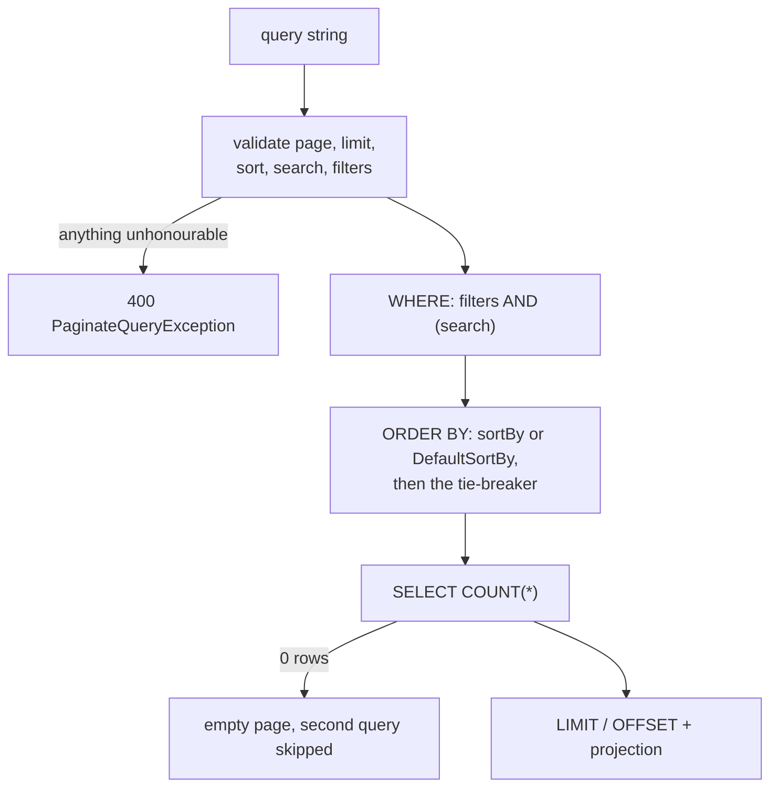
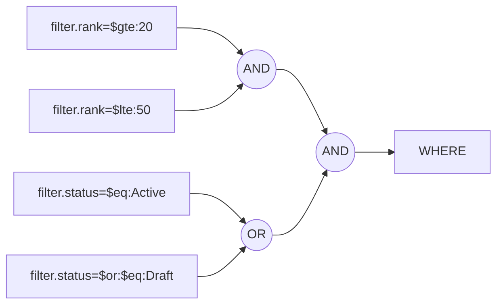

# Query-string contract

The complete wire format. Six inputs, nothing else:

| Parameter        | Repeatable | Example                       | Notes |
|------------------|:----------:|-------------------------------|-------|
| `page`           | no         | `?page=2`                     | 1-based, defaults to `1`. |
| `limit`          | no         | `?limit=50`                   | Defaults to the config's `DefaultLimit`, capped by `MaxLimit`. |
| `sortBy`         | **yes**    | `?sortBy=price:DESC&sortBy=name:ASC` | Applied in the order given. |
| `search`         | no         | `?search=acme`                | Free text over the searchable fields. |
| `searchBy`       | **yes**    | `?searchBy=name&searchBy=sku` | Narrows `search` to a subset of them. |
| `filter.<field>` | **yes**    | `?filter.status=$eq:Active`   | One or more criteria per field. |

**Anything else is ignored.** `offset`, `utm_source`, your own tracking parameters — the binder reads exactly
the six above and pages normally. This is deliberate: strict binding would reject perfectly ordinary client
parameters. `page` and `limit` themselves *are* validated and return `400`.

For repeatable parameters, repeat the key (`?sortBy=a:ASC&sortBy=b:DESC`). Comma-joining them in one value
does **not** work — that reads as a single malformed instruction.

## How a request becomes a query



Two things follow from that shape, and both are visible in the SQL:

- **Validation happens before the database is touched.** A rejected request costs no query.
- **A page is two queries, and sometimes one.** The count runs first; when it comes back `0`, the second
  query is never sent. A filter that cannot match anything therefore costs exactly one cheap count.

::: info About the SQL on this page
Every statement quoted here was captured from the engine running against **SQLite**, so the text is that
provider's. What is stable across providers is the *shape*: which predicate an operator produces, how criteria
combine, and where the parameters sit. Collection operators in particular look different elsewhere — SQLite
reaches into a JSON column with `json_each`, another provider will not.
:::

## `page`

1-based. Must parse as a positive integer with no sign, decimal point or padding — `0`, `-1`, `+2`, `2.0` and
`abc` all return `400 Query parameter 'page' must be a positive integer.`

The value becomes the `OFFSET`, always as a parameter:

```sql
-- ?page=2&limit=3
SELECT "p"."Id", "p"."Name", "p"."Status", "p"."Rank"
FROM "Products" AS "p"
ORDER BY "p"."Rank", "p"."Id"
LIMIT @p OFFSET @p
```

Pages past the end are **not** an error: you get `items: []` with truthful `meta`, and the engine skips the
second query entirely.

## `limit`

Omitted → the config's `DefaultLimit`. Supplied → must be between `1` and the config's `MaxLimit`, otherwise
`400 Query parameter 'limit' must be between 1 and 100.` An over-large limit is **rejected, not clamped** —
silently returning fewer rows than asked for is the harder bug to notice.

## `sortBy`

```
sortBy=<field>:<ASC|DESC>
```

Both parts are required — a bare `?sortBy=name` is a `400`. The direction is case-insensitive; the field name
is matched against the configured `Sortable` names, also case-insensitively. Repeat the parameter for
secondary sorts, in priority order:

```http
GET /products?sortBy=status:ASC&sortBy=rank:DESC
```

```sql
ORDER BY "p"."Status", "p"."Rank" DESC, "p"."Id"
```

That trailing `"p"."Id"` is the tie-breaker, and it is the whole point of the feature: two products sharing a
status and a rank would otherwise be free to swap places between page 1 and page 2, dropping one row and
repeating another.

- More than `MaxSortFields` (default 5) → `400`.
- A field that is not configured sortable (or is disabled for this caller via [`.When(...)`](/guide/configuration/#when--conditional-fields)) → `400 Sort for field 'x' is not configured.`
- No `sortBy` at all → the config's `DefaultSortBy` entries, in declaration order.
- The configured **tie-breaker is always appended last**, whichever of the two applied.

If there is no `sortBy`, no `DefaultSortBy` and no tie-breaker, the engine refuses the request rather than
paging an unordered set:

> Pagination requires a deterministic sort order. Pass 'sortBy', configure DefaultSortBy(...), or add
> WithTieBreaker(...) to the pagination configuration.

## `search` and `searchBy`

`search` matches a substring, case-insensitively on PostgreSQL with the `.PostgreSql` package (see
[Providers](/integrations/postgresql/)), otherwise per the column collation. The term is matched against every
configured searchable field and the results OR'd together:

```http
GET /products?search=gizmo
```

```sql
WHERE "p"."Name" LIKE @p ESCAPE '\'
   OR ("p"."Description" IS NOT NULL AND "p"."Description" LIKE @p ESCAPE '\')
```

Two details worth reading off that: the same parameter is reused for every field, and a **nullable** column
gets an explicit `IS NOT NULL` companion so the predicate stays three-valued-logic safe.

`searchBy` narrows the same term to a subset:

```http
GET /products?search=gizmo&searchBy=name
```

```sql
WHERE "p"."Name" LIKE @p ESCAPE '\'
```

- `%` and `_` in the term are escaped — hence the `ESCAPE '\'` — so they match literally rather than as
  wildcards.
- Longer than `MaxSearchLength` (default 256) → `400`.
- A `searchBy` field that is not searchable → `400`; the same field twice → `400`. Both are validated **even
  when `search` is absent**, so a typo surfaces instead of silently searching everything.
- If the config declares no searchable fields at all, sending `search` is a `400`, not a no-op.
- `IgnoreSearchByInQueryParam()` in the config makes `searchBy` ignored entirely; search then always spans all
  searchable fields.

**Search and filters are AND'ed**, with the search block parenthesised as a unit:

```http
GET /products?filter.status=$eq:Active&search=widget
```

```sql
WHERE "p"."Status" = @p
  AND ("p"."Name" LIKE @p1 ESCAPE '\' OR ("p"."Description" IS NOT NULL AND "p"."Description" LIKE @p1 ESCAPE '\'))
```

## `filter.<field>`

### Grammar

```
filter.<field> = [$not:] [$and: | $or:] $<operator>[:<value>[,<value>…]]
```

The prefixes are optional and order-independent. Parsing splits on the first `:` at each step and stops at the
first operator token — **everything after that colon is the value, verbatim**. That rule is what lets values
carry colons of their own:

```http
?filter.createdAt=$gte:2026-01-01T00:00:00Z
?filter.name=$eq:Doohickey: legacy
```

The second one filters for the literal name `Doohickey: legacy`. Nothing after the operator's colon is
inspected again.

Field names are matched case-insensitively, and case variants of the same field collapse into one entry, so
`?filter.Status=…&filter.status=…` is two criteria on one field rather than two fields.

### Operator reference

Each field whitelists its own operators in the config; sending one that is not whitelisted for that field is a
`400`, even though it exists. The SQL column shows the predicate the engine builds, with the surrounding
`SELECT`/`ORDER BY` trimmed away.

#### `$eq` — equality

```http
?filter.status=$eq:Active
```
```sql
WHERE "p"."Status" = @p
```

#### `$in` — one of

Comma-separated. On SQLite the list arrives as a single JSON parameter rather than an inlined `IN (…)`, which
is exactly the point of parameterising: one cached plan, whatever the list contains.

```http
?filter.status=$in:Active,Draft
```
```sql
WHERE "p"."Status" IN (SELECT "p0"."value" FROM json_each(@p) AS "p0")
```

An empty list is `400 Filter 'x' requires at least one '$in' value.`

#### `$null` — is null

Takes no value:

```http
?filter.description=$null
```
```sql
WHERE "p"."Description" IS NULL
```

On a **non-nullable** column the predicate is constant-folded, and the result is visible in the SQL rather
than merely described:

```http
?filter.rank=$null          → WHERE 0        (matches nothing, and the second query never runs)
?filter.rank=$not:$null     → no WHERE       (matches everything)
```

#### `$sw` — starts with

```http
?filter.name=$sw:Wid
```
```sql
WHERE "p"."Name" LIKE @p ESCAPE '\'      -- parameter: 'Wid%'
```

#### `$ilike` and `$contains` on a string — contains

The two are the same predicate on a string field:

```http
?filter.name=$ilike:widget
?filter.name=$contains:widget
```
```sql
WHERE "p"."Name" LIKE @p ESCAPE '\'      -- parameter: '%widget%'
```

With the `.PostgreSql` package registered, the same request emits native `ILIKE` instead. Without it, `$ilike`
is only as case-insensitive as the column's collation — the token names the intent, not a guarantee.

#### `$contains` on a collection — set containment

On a collection field, `$contains` means the collection holds **all** the listed values, so each value becomes
its own `AND`-ed predicate:

```http
?filter.tags=$contains:red
```
```sql
WHERE @p IN (SELECT "t"."value" FROM json_each("p"."Tags") AS "t")
```

```http
?filter.tags=$contains:red,small
```
```sql
WHERE @p  IN (SELECT "t"."value"  FROM json_each("p"."Tags") AS "t")
  AND @p1 IN (SELECT "t0"."value" FROM json_each("p"."Tags") AS "t0")
```

An empty list is `400 Filter 'x' requires at least one '$contains' value.`, and `$contains` on a scalar
non-string field is `400 Filter 'x' supports '$contains' only for string or collection fields.`

#### `$lt` `$lte` `$gt` `$gte` — comparisons

```http
?filter.rank=$gte:3
```
```sql
WHERE "p"."Rank" >= @p
```

#### `$btw` — inclusive range

Exactly two comma-separated values; anything else is `400 Filter 'x' requires exactly two '$btw' values.`
It expands to the pair of comparisons rather than a `BETWEEN` keyword:

```http
?filter.rank=$btw:20,50
```
```sql
WHERE "p"."Rank" >= @p AND "p"."Rank" <= @p1
```

Which is byte-for-byte what `?filter.rank=$gte:20&filter.rank=$lte:50` produces. `$btw` is a shorthand, not a
different query.

### Fields that are not columns

A filterable field can point at a related entity's property, in which case the engine joins:

```http
?filter.categoryName=$eq:Electronics
```
```sql
FROM "Products" AS "p"
LEFT JOIN "Categories" AS "c" ON "p"."CategoryId" = "c"."Id"
WHERE "c"."Name" = @p
```

A field declared with `FilterableMany(...)` matches when **any** element of a sub-collection satisfies the
criterion, which becomes an `EXISTS`:

```http
?filter.reviewer=$eq:ann
```
```sql
WHERE EXISTS (SELECT 1 FROM "Reviews" AS "r" WHERE "p"."Id" = "r"."ProductId" AND "r"."Reviewer" = @p)
```

```http
?filter.rating=$gte:4
```
```sql
WHERE EXISTS (SELECT 1 FROM "Reviews" AS "r" WHERE "p"."Id" = "r"."ProductId" AND "r"."Rating" >= @p)
```

Note what that means for a request combining two of them: `?filter.reviewer=$eq:ann&filter.rating=$gte:4`
matches a product with a review by `ann` **and** a review rated 4 or better — not necessarily the same review.
Each criterion gets its own `EXISTS`. When you need "the same element satisfies both", model it as one
filterable field over a computed value.

### `$not` — negation

Negates the single criterion it prefixes, and the negation reaches the SQL rather than wrapping it in a `NOT (…)`:

```http
?filter.status=$not:$eq:Discontinued     → WHERE "p"."Status" <> @p
?filter.name=$not:$ilike:apple           → WHERE "p"."Name" NOT LIKE @p ESCAPE '\'
?filter.deletedAt=$not:$null             → WHERE "p"."DeletedAt" IS NOT NULL
```

### `$and` / `$or` — combining criteria on one field

Repeat `filter.<field>` to apply several criteria to the same field. Each criterion says how it joins the ones
before it; the default is `$and`:

```http
# 20 <= rank <= 50
?filter.rank=$gte:20&filter.rank=$lte:50
```
```sql
WHERE "p"."Rank" >= @p AND "p"."Rank" <= @p1
```

```http
# status is Active OR Draft
?filter.status=$eq:Active&filter.status=$or:$eq:Draft
```
```sql
WHERE "p"."Status" = @p OR "p"."Status" = @p1
```

Criteria on **different** fields are always joined with `AND`. There is no cross-field `OR` and no grouping /
parentheses — that is a deliberate ceiling on how much query language is exposed. Combine on one field, and
express anything richer as a dedicated filterable field.



### Value formats

| Target type | Accepted |
|-------------|----------|
| `string` | anything, used verbatim |
| `bool` | `true` / `false`, case-insensitive (not `1` / `0`) |
| `Guid` | any format `Guid.TryParse` accepts |
| integers, `decimal`, `float`, `double` | invariant culture — `.` as the decimal separator |
| `DateTime`, `DateTimeOffset` | invariant culture; a value with no offset is read as **UTC** |
| enums | **by name only**, case-insensitive (`Active`, `active`). Numeric values are rejected, and so is a number that does not correspond to a defined member. |
| `Instant`, `LocalDate` | ISO-8601, with the `.NodaTime` package |
| anything else | `400`, unless registered via [`PaginateTypeSupport`](/integrations/custom-types/) |

An empty value (`?filter.price=$eq:`) is `null` for a nullable target and a `400` for a non-nullable one. Use
`$null` rather than relying on that.

**No escaping inside value lists.** `$in`, `$btw` and `$contains`-on-a-collection split on `,` and trim; a
value that itself contains a comma cannot be expressed. Single-value operators take the value whole, commas
included.

Values are emitted as SQL **parameters** (`EF.Parameter`), never inlined literals — every `@p` on this page is
that at work. The database can reuse one plan across every value your callers send, and a value can never be
read as SQL.

## Guards

Per-config ceilings that bound how expensive one request can be. Defaults shown; change them with
[`WithGuards(...)`](/guide/configuration/#withguards).

| Guard | Default | Exceeded → |
|-------|--------:|------------|
| `MaxLimit` | *(required, no default)* | `400 Query parameter 'limit' must be between 1 and N.` |
| `MaxFilterValues` | 100 | `400 Filter 'x' accepts at most N values.` |
| `MaxFilterConditions` | 20 | `400 Too many filter conditions; at most N are allowed.` |
| `MaxSortFields` | 5 | `400 Too many sort fields; at most N are allowed.` |
| `MaxSearchLength` | 256 | `400 Search term must not exceed N characters.` |

`MaxFilterConditions` counts every `filter.*` value across all fields, so 20 conditions total — not 20 per
field.

## Error catalogue

Everything below is a `PaginateQueryException`, surfaced by the ASP.NET Core integration as
`400 Bad Request` with `title: "Invalid query"` and the message as `detail`. See
[ASP.NET Core → Errors](/integrations/aspnetcore/#errors-as-problemdetails).

| Message | Cause |
|---------|-------|
| `Query parameter 'page' must be a positive integer.` | `page` is not a plain positive integer. |
| `Query parameter 'limit' must be between 1 and N.` | `limit` out of range. |
| `Sort value 'x' must use the format 'field:ASC' or 'field:DESC'.` | Missing the `:direction` half. |
| `Sort direction 'x' is not supported.` | Direction is neither `ASC` nor `DESC`. |
| `Too many sort fields; at most N are allowed.` | More `sortBy` values than `MaxSortFields`. |
| `Sort for field 'x' is not configured.` | Not declared `Sortable`, or disabled by `.When(false)`. |
| `Pagination requires a deterministic sort order. …` | No `sortBy`, no `DefaultSortBy`, no tie-breaker. |
| `Search term must not exceed N characters.` | `search` longer than `MaxSearchLength`. |
| `Search is not configured for this resource.` | `search` sent to a config with no searchable fields. |
| `Search for field 'x' is not configured.` | Unknown `searchBy` field. |
| `Search field 'x' is specified more than once.` | Duplicate `searchBy` value. |
| `Filter for field 'x' is not configured.` | Not declared `Filterable`, or disabled by `.When(false)`. |
| `Filter 'x' must not be empty.` | `?filter.x=` with no value at all. |
| `Filter 'x' uses unknown operator '$foo'.` | Token is not one of the operators above. |
| `Filter 'x' must use the format '$operator:value'.` | No operator token, or an operator other than `$null` used bare. |
| `Filter 'x' does not support operator '$foo'.` | Valid operator, not whitelisted for that field. |
| `Filter 'x' requires at least one '$in' value.` | `$in` with an empty list. |
| `Filter 'x' requires exactly two '$btw' values.` | `$btw` with anything but two values. |
| `Filter 'x' requires at least one '$contains' value.` | `$contains` on a collection with an empty list. |
| `Filter 'x' supports '$contains' only for string or collection fields.` | `$contains` on a scalar. |
| `Filter 'x' supports string pattern operators only for string fields.` | `$sw` / `$ilike` on a non-string. |
| `Too many filter conditions; at most N are allowed.` | Over `MaxFilterConditions`. |
| `Filter 'x' accepts at most N values.` | Over `MaxFilterValues` in one list. |
| `Value 'v' is not valid for type 'T'.` | Unparseable, or an undefined enum member. |
| `Value 'v' is not a valid GUID.` / `boolean` / `instant` / `local date` | Type-specific parse failure. |
| `Value for type 'T' must not be empty.` | Empty value for a non-nullable target. |
| `Filtering values of type 'T' is not supported.` | No parser registered for that CLR type. |

A field disabled by `.When(false)` reports **exactly** the same message as a field that does not exist — the
existence of an admin-only field is not disclosed to callers who cannot use it.

## One request, end to end

```http
GET /products?page=1&limit=3&sortBy=status:ASC&sortBy=rank:DESC
              &search=wid&filter.status=$eq:Active&filter.rank=$btw:20,50
```

becomes one count and one page, both fully parameterised:

```sql
SELECT COUNT(*)
FROM "Products" AS "p"
WHERE "p"."Status" = @p AND "p"."Rank" >= @p1 AND "p"."Rank" <= @p2 AND ("p"."Name" LIKE @p3 ESCAPE '\' OR ("p"."Description" IS NOT NULL AND "p"."Description" LIKE @p3 ESCAPE '\'))

SELECT "p"."Id", "p"."Name", "p"."Status", "p"."Rank"
FROM "Products" AS "p"
WHERE "p"."Status" = @p AND "p"."Rank" >= @p1 AND "p"."Rank" <= @p2 AND ("p"."Name" LIKE @p3 ESCAPE '\' OR ("p"."Description" IS NOT NULL AND "p"."Description" LIKE @p3 ESCAPE '\'))
ORDER BY "p"."Status", "p"."Rank" DESC, "p"."Id"
LIMIT @p8 OFFSET @p7
```

Four criteria, one `WHERE`, and not a single value inlined. Note the parameter numbering: the engine reuses
`@p3` for both halves of the search, and the paging parameters land at the end wherever the count of earlier
parameters puts them.

The `SELECT` list is the projection's, not the entity's — see [Projections](/guide/projections/) for how that
list is decided and how to widen it without loading the whole row.
